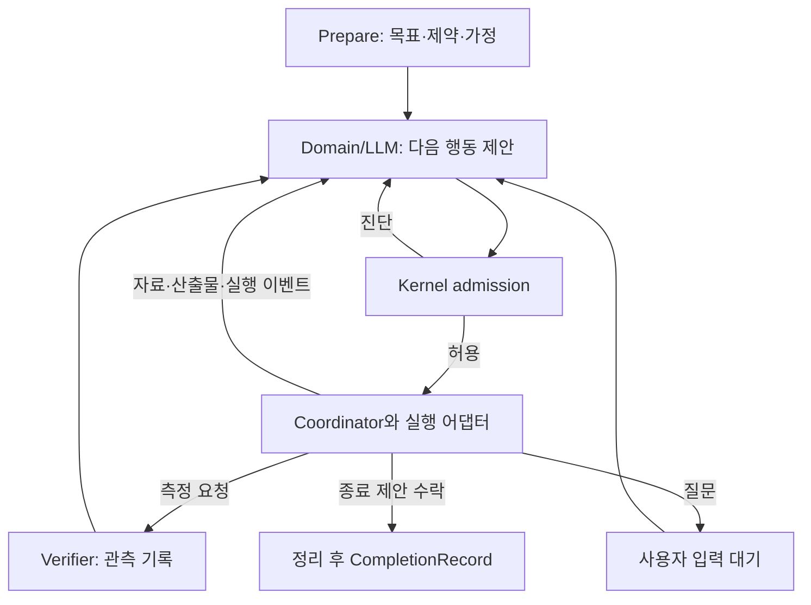

# Domain 자율 판단과 관측 중심 Verifier: 핵심 설계 v1

작성일: 2026-09-18. 상태: **M0–M3 구현·검증 완료, M4–M5 후속**.

이 문서는 사용자가 제시한 `Prepare → Explore → Execute → Verify` 방향을 구현 가능한 데이터 계약과 상태 전이로 구체화한다. M1–M3는 제품 코드에 명시적 `autonomous-v1` 선택 경로로 연결했으며 기본값과 AGENTS.md의 legacy Python-only Ready 규칙은 유지한다. M4 반영·재귀 작업과 M5 제품 전환은 아직 이 문서의 후속 설계다.

설계용 타입은 [contracts.ts](design/autonomous-domain-core/contracts.ts), 사용 예와 금지된 타입 조합은 [examples.ts](design/autonomous-domain-core/examples.ts)에 있다. 두 파일은 제품에 import되지 않는다. 타입 검사는 권한 검사나 런타임 구현 검증을 대신하지 않는다.

## 1. 설계 목표와 확정 결정

사용자의 요구를 행동할 수 있을 만큼 이해한 뒤, 해결 방법과 관측의 충분성은 Domain/LLM이 판단한다. Kernel은 권한·자원·상태·데이터 계약을 검사한다. Verifier는 특정 대상에 대한 관측을 남긴다.

| 결정 | 확정한 내용 |
| --- | --- |
| D1 요구 해석 | 원래 요청과 사용자 제약에는 출처를 남기고, 모델의 해석·가설·계획은 별도 개정한다. |
| D2 Prepare | 필수 입력, 명백한 구조 오류·모순, 실행 권한의 모호함만 우선 해결한다. 완성된 풀이와 검증 계획은 요구하지 않는다. |
| D3 해결 방법 | 단순 작업은 바로 실행할 수 있다. 탐색·분해·위임·측정의 순서와 반복 여부는 Domain/LLM이 정한다. |
| D4 관측 | Verifier가 관측 기록을 만들고, Domain/LLM이 그 의미와 다음 행동을 판단한다. 관측에는 retry/repair/Ready 명령이 없다. |
| D5 종료 | 실행 종료, 모델의 달성 판단, 검사 결과를 독립적으로 표현한다. 불확실성이 있는 종료를 허용한다. |
| D6 반영 | Candidate의 바이트 무결성·반영 권한과 목표 달성 판단을 분리한다. 모델은 반영을 제안하고 런타임이 실제 반영한다. |
| D7 자율성의 범위 | 모델이 권한·예산을 발급하거나 관측을 위조할 수 없다. 제안 거절은 데이터/권한 진단이며 자동 수정 지시가 아니다. |
| D8 이행 | 새 실행 의미는 `autonomous-v1`로 Run 시작 시 고정한다. 기존 Run·Ready 기록을 새 의미로 재해석하지 않는다. |

이번 범위는 내부 Skill/Context 확장, 신규 모델 도입, 상용 모델 품질 평가, 재시작 후 자동 실행 복원, 외부 실행기의 신규 기능 구현을 포함하지 않는다.

## 2. 현재 구조와 변경 지점

| 현재 코드 | 현재 의미 | 새 경로의 변경 |
| --- | --- | --- |
| [공통 계약](../runtime/packages/domain-contracts/src/goal-contract.ts) | GoalContract에 목표·검증 조건이 함께 있음 | Intent, WorkingInterpretation, AuthorityGrant, 선택적 측정 요청으로 역할 분리 |
| [리뷰 정책](../runtime/packages/kernel/src/contract/review-policy.ts) | 구현 선택 외 불확실성을 질문 대상으로 분류 | 진행을 막는 정보·권한 문제와 탐색 가능한 가정을 구분 |
| [Kernel](../runtime/packages/kernel/src/index.ts) `decidePlanning()` | 위험도·Claim 수 등으로 planned 경로 선택 | 풀이 방식 선택은 Domain으로 이동; 명시적 plan-only 경계는 유지 |
| [Coordinator](../runtime/packages/coordinator/src/index.ts) `verifyRoot()` | Verifier의 repair 결과로 통합 실행을 반복 | 관측 전달 후 모델의 다음 제안을 처리 |
| 같은 파일 `validateDomainResultBinding()` | General 답변과 파일 predicate 문자열 비교 | Run/실행기/버전 검사는 유지하고 목표 의미 판정은 이동 |
| [Python](../src/harness/verification_v2.py) `_reject()` | repair 횟수·수정 범위·다음 상태 결정 | 측정 실패/오류만 기록 |
| 같은 파일 `handle()` | scope_verified/ready 발급 | 관측 응답과 대상 무결성 확인으로 역할 분리 |
| [Workspace](../runtime/packages/workspace/src/orchestration.ts) `startChild()` | 계획 전 탐색 자식 한 번 제한 | 범위·자원 안에서 반복·중첩 작업 허용 |
| 같은 파일 `commitCandidate()` | 검증 성공 attestation과 반영 결합 | 무결성 receipt + 반영 permit + 명시적 gate 검사 |
| [실행 상태](../runtime/packages/coordinator/src/contracts.ts), [검증 상태](../runtime/packages/verification/src/types.ts) | outcome/readyEligible/repairCount에 제어·판정 혼합 | RunLifecycle, DomainAssessment, ObservationReport로 분리 |

## 3. 책임과 권한

| 계층 | 소유하는 것 | 만들 수 없는 것 |
| --- | --- | --- |
| 사용자·앱 정책 | 원래 요청, 명시적 제한, 실행 권한의 근거, 자원 한도 | 관측하지 않은 검사 결과 |
| Domain 전략 | 분석에 필요한 입력 구성, 후보 응답 정규화, 도메인별 결과 표현 | 세션 상태 직접 변경, 도구 실행 권한, 신뢰된 관측 |
| LLM | 가설·계획·작업 분해·측정 제안·달성 판단·다음 행동 제안 | 권한 grant, 실측 사용량, 실행 permit, 관측 attestation |
| Host/앱 어댑터 | 사용자 입력 출처, 모델·도구 호출, 질문 서비스, 실제 이벤트 | 모델 텍스트를 측정 성공으로 승격 |
| Kernel | 구조·참조·권한·예산·상태에 대한 순수 admission 함수 | 풀이 순서 강제, 추론의 정답 판정, 파일·모델 호출 |
| Coordinator | Run/Task 수명주기, 자원 예약, 스케줄링, 취소, 이벤트 연결 | 실패 관측만으로 의미적 수정·재시도를 결정 |
| Verifier | 요청된 검사 실행과 결과 수집, 대상·출처·환경 기록 | 다음 행동, 전체 목표 성공, 자동 repair/Ready |
| Workspace | 격리된 변경, 스냅샷, 충돌 검사, 원자적 반영·복구 | 검사 통과를 이유로 권한 범위 확대 |

### 불변조건

- I1: 모델 응답은 항상 제안이다. grant/permit/관측 기록은 각각의 인증된 런타임 경로에서만 생성한다.
- I2: 행동은 현재 Run과 유효한 권한·예산·대상 버전에 연결되어야 한다.
- I3: 해석 변경·하위 작업 생성·재시도는 권한이나 예산을 새로 만들지 않는다.
- I4: 관측은 불변이다. 새 바이트, 새 검사 또는 새 환경은 새 관측을 만든다.
- I5: 검사 실패는 실제 측정의 결과이며, 자동 수정 지시나 전체 목표 실패와 동치가 아니다.
- I6: 종료는 성공 증명과 동치가 아니다. 미실행·오류·불확실성은 최종 기록에 남는다.
- I7: 반영은 정확한 Candidate와 baseline에 대해 한 번만 실행하며 기존 충돌·복구 경계를 통과한다.
- I8: 사용자·정책의 명시적 강제 조건은 모델이 삭제하거나 완화할 수 없다. 모델이 제안한 검사에는 자동 강제력이 없다.
- I9: 모델의 자연어 지침이 권한·제어의 유일한 강제 수단이 되어서는 안 된다.

## 4. 데이터 계약

구체적 필드는 [설계용 타입](design/autonomous-domain-core/contracts.ts)을 따른다. 아래 표의 소유권과 유효성 규칙은 타입 외의 런타임 검사 사항이다.

| 데이터 | 생성/수락 주체 | 개정과 유효성 |
| --- | --- | --- |
| IntentRecord | Host가 원문 출처와 함께 저장 | 사용자 요청이 바뀌면 새 revision. 모델이 원문이나 명시적 제약을 덮어쓰지 못함 |
| WorkingInterpretation | 모델 제안, Host 구조 검사 후 저장 | 목표 해석·가정·열린 질문·검사 후보를 수시 개정. 권한은 포함하지 않음 |
| AuthorityGrant | 기존 permission 서비스·사용자 승인·앱 정책을 통해 Host 발급 | Run에 연결. 하위 grant는 부모의 부분집합. 허용 범위 확대는 권한 서비스로 재진입 |
| RunBinding | Host/Coordinator | Domain/실행기 개정과 semantics를 고정. 권한 갱신은 이력이 있는 명시적 사건 |
| BudgetLimits/ledger | 앱 정책 + Coordinator | 전체 Run의 누적 사용·예약 원장. 해석 개정이나 child마다 초기화하지 않음 |
| CheckSpec | 모델/사용자/앱이 제안, Host가 등록 | 검사 코드·인자·실행기·환경 요구를 해시로 식별. author 출처 보존 |
| ObservationReport | 인증된 Verifier 어댑터 | request/Run/Task/subject/check/environment에 귀속. goal outcome 필드 없음 |
| DecisionProposal | 모델 또는 기존 도구 호출을 정규화한 어댑터 | basis의 Run·Task·해석·권한 참조 검증 후 한 번만 실행 |
| CandidateIntegrityReceipt | Workspace 런타임 | 현재 바이트·baseline의 무결성 확인. 의미적 정답 보증 없음 |
| CompletionRecord | Coordinator | 정리 완료 후 한 번 생성. 모델 결론과 종료 사유를 별도 저장 |

VersionRef의 숫자 revision은 저장 기록의 버전이다. Domain/실행기의 기존 문자열 revision을 숫자로 변환하지 않는다. RunBinding의 참조는 실제 전략·overlay ID/revision, provider/model/connection/options, 지원 기능을 포함한 기존 등록 스냅샷을 식별한다. 원래 식별자는 스냅샷 안에 그대로 보존한다.

### 4.1 목표·해석·권한의 개정 규칙

1. 원래 요청을 `IntentRecord.originalRequest`로 보관한다. 요구사항과 제약의 분해 결과에도 원문 참조를 남긴다. 원문이 최종 해석 기준이다.
2. 모델은 WorkingInterpretation을 수정할 수 있다. 내부 사고 전체를 저장할 필요는 없고, 실행에 영향을 주는 가정·질문·작업 변경만 남긴다.
   제안은 basedOnRef를 참조하며 새 기록의 ID/revision/hash는 Host가 생성한다. 모델이 지정한 새 버전을 신뢰하여 덮어쓰지 않는다.
3. 순수 해석 개정은 Run이나 budgetId를 새로 만들지 않는다. 이미 수집한 관측도 삭제하지 않는다.
4. 개정 영향이 있는 미실행 제안만 재검사한다. 다른 자식의 무관한 이벤트 때문에 모든 제안을 일괄 무효화하지 않는다.
5. 새 사용자 요구와 권한 축소는 영향을 받는 대기 permit을 폐기한다. 실행 중 영향받는 작업은 취소·정리하고 결과는 과거 버전에 귀속한다.
6. 변경 권한은 Claim의 의미나 최대 criterion risk로 추론하지 않는다. 실행 operation/resource scope를 기존 권한 서비스가 수락한 grant에서 얻는다.

### 4.2 SubjectRef: 무엇을 측정했는가

`source`, `report`, `candidate`, `workspace`, `resource_snapshot`을 구분한다.

- 소스 파일의 content_equals는 해당 소스 바이트를 측정한다. 최종 답변 전체의 문자열 조건으로 전용하지 않는다.
- 보고서의 인용·항목·내용을 검사하려면 `report`를 대상으로 하는 별도 CheckSpec을 사용한다.
- Candidate의 digest는 변경 파일만이 아니라 검사에 필요한 baseline과 materialized workspace 입력을 포함하는 manifest를 식별한다.
- 읽은 자료와 명령 실행 환경도 가능한 범위에서 snapshot/digest로 고정한다. 전체 환경을 고정할 수 없으면 그 한계를 limitations에 적는다.
- 네트워크 등 변동 가능한 자원은 관측 시각·원격 식별자·응답 snapshot을 보관한다. 과거 결과가 현재에도 참이라고 자동 승격하지 않는다.
- 같은 해시의 자료는 새 분석에서 참고할 수 있다. 현재 행동의 명시적 gate 충족에는 해당 gate의 대상·검사·환경·유효기간 규칙을 적용한다.

### 4.3 ObservationReport: 사실과 국소 비교

측정 결과는 `execution=completed | not_run | error`로 구분한다. completed에는 단순 값이나 특정 비교의 pass/fail을 넣을 수 있다. 프로세스 exit=1은 실행 오류가 아니라 정상 완료된 검사의 실패 관측일 수 있다. timeout·실행기 시작 실패는 error다.

예: `candidate revision 7 / check revision 2 / exit expected 0, observed 1 / comparison fail`.

이 결과로 버그의 원인, 요구사항 전체의 충족, 다음 수정 대상을 자동 확정하지 않는다. 테스트 자체가 잘못됐을 가능성도 Domain/LLM의 분석 대상이다.

신뢰는 **누가 어떤 대상에서 무엇을 관측했는가**에 적용된다. 모델이 만든 테스트를 실제로 실행했다고 해서 그 테스트의 타당성·독립성까지 신뢰하는 것은 아니다. ad-hoc 검사는 author=model을 유지한다. 같은 검사에 이름만 바꾼 기록을 독립 근거로 자동 계수하지 않는다.

측정 코드도 실제 행동이다. 명령·네트워크·파일 부작용은 기존 ToolRegistry/Sandbox/권한/예산을 통과해야 한다. 테스트라는 이유로 별도 무제한 실행 경로를 만들지 않는다. 신뢰된 Python 채널이 프로세스 결과를 기록하고 런타임이 채널·request·subject를 확인한다. 관측 JSON의 producer 문자열만으로 출처를 신뢰하지 않는다.

LLM 평가를 추가하더라도 그 응답은 DomainAssessment 또는 후보 자료다. 이를 관측 가능한 사실로 포장하지 않는다.

### 4.4 명시적 gate와 모델의 판단

ActionGate는 사용자 또는 신뢰된 앱 정책이 지정한, 기계적으로 검사 가능한 조건만 표현한다. gate가 어떤 행동에 적용되는지 명시한다.

| gate 대상 | 동작 |
| --- | --- |
| apply_candidate | 조건이 unmet/unknown이면 해당 Candidate 반영 거절. 후보 보관·부분 종료는 가능 |
| external_publish | 지정된 외부 반영 동작만 거절. 다른 허용된 조사·보고는 가능 |
| finish_satisfied | 명시된 필수 검사가 unmet/unknown이면 satisfied 결론을 포함한 종료 제안을 거절. partial/unsolved/not_assessed 종료 가능 |

gate의 subject는 보호하는 행동에서 결정한다. 다른 Candidate revision의 통과 기록을 대입할 수 없다. requiredComparisons가 없는 빈 gate를 통과로 취급하지 않는다.

모델이 제안한 성공 기준, 검사 횟수, 독립 근거 수는 기본적으로 조언이다. 명시적 gate로 등록되지 않은 것은 Kernel의 완료 강제 조건이 아니다. 자연어 요구의 충족 여부를 Kernel이 새 규칙이나 키워드로 추론하지 않는다.

기존 defaultStrength, criterionTemplates, 위험도별 독립 증거 수, 테스트 이름을 자동으로 새 hard gate로 옮기지 않는다. 앱의 강제 조건도 출처와 보호하는 행동을 노출해야 한다. 어떤 검사가 요구사항에 적합한지는 Domain/LLM이 검토하며, 등록된 조건의 수행 여부만 런타임이 검사한다.

gate 거절도 자동 재시도를 발생시키지 않는다. Domain/LLM은 추가 측정, 접근 변경, 질문 또는 부분 종료를 선택한다. hard gate 수정은 출처가 확인된 사용자/정책 변경을 요구한다.

## 5. Prepare와 Domain/LLM 루프

### 5.1 Prepare의 출력

준비 결과는 다음 세 가지다.

- `proceed`: 실행 가능한 목표·현재 권한이 있으며 미확인 부분은 가정으로 남김.
- `needs_input`: 행동 대상·필수 입력·권한을 결정할 수 없는 실제 차단 사유가 있음.
- `invalid`: 깨진 데이터 구조, 알 수 없는 참조, 모순된 권한 같은 제출 오류.

복잡한 작업, 여러 해석 가능성, 검증 방법 미정만으로 질문·메타리뷰를 강제하지 않는다. 명백한 의미적 누락·오해는 Domain/모델의 가벼운 확인으로 다루며, Kernel Prepare에 자연어 의미 판정기를 넣지 않는다. 모델의 위험한 가정은 제안 이후 실제 권한 검사에서도 막힌다.

### 5.2 기존 모델 루프 재사용

Domain은 모델 요청 구성과 응답 정규화에 관여하고, 모델 호출은 앱 어댑터가 수행한다. Kernel이나 Domain 함수가 I/O를 직접 하지 않는다. 새로운 두 번째 agent loop는 만들지 않는다.



Explore/Execute/Verify는 행동 종류다. 반드시 모두 거쳐야 하는 전역 상태의 순서가 아니다. 탐색은 read/search/invoke와 하위 Task 생성으로 표현하며, 매 도구 호출 전에 완성된 정형 분석서를 요구하지 않는다.

DecisionProposal은 실행 경계에 공통으로 쓰는 내부 표현이다. 일반 tool call은 기존 어댑터가 invoke로 정규화한다. 모델이 통제하지 않는 Run ID, task ID, authority 참조는 Host가 현재 호출 컨텍스트에서 채우고 모델/외부 실행기가 보낸 값과 혼합하지 않는다. 명시적으로 전달된 basis가 있으면 일치 여부도 검사한다.

종료·해석 개정·측정·작업 그래프 변경에는 타입을 명확히 사용한다. 모델 응답의 특정 자연어 문구를 찾아 성공이나 권한을 하드코딩하지 않는다. 외부 실행기도 같은 계약을 따른다.

### 5.3 제안 처리 순서와 중복 처리

1. 현재 인증된 Run/Task에서 온 호출인지 확인한다.
2. 스키마, 필드 allowlist, 참조 존재, 작업별 basis와 대상 revision을 검사한다.
3. operation/resource scope, 명시적 gate, 지원 기능, 취소·기한을 검사한다.
4. Coordinator가 전체 자원을 원자적으로 예약하고 permit을 생성한다.
5. 상태 변경 직전 permit의 권한 revision·대상·취소 여부를 다시 검사한다.
6. 결과·사용량·관측을 저장하고 필요한 다음 모델 턴을 기존 루프에 공급한다.

같은 decisionId/requestId와 동일한 정규화 payload는 기존 결과를 돌려준다. 동일 ID의 다른 payload는 거절한다. 대상/권한 개정으로 오래된 제안은 자동 최신화하지 않는다. Domain에 현재 상태와 진단을 전달한다. 거절된 제안도 사용한 모델·도구 비용을 초기화하지 않는다.

관측·artifact ID는 현재 세션의 접근 가능한 저장소에서 해석한다. 다른 Run의 자료는 권한이 확인된 이력 조회를 통해 과거 관측임을 표시해 제공하며, 다른 세션의 ID를 제시했다는 이유만으로 내용을 읽거나 현재 관측으로 승격하지 않는다.

## 6. Run과 Task 상태 전이

### 6.1 Run 상태

| 현재 | 사건 | 다음 | 조건/기록 |
| --- | --- | --- | --- |
| preparing | proceed | active | 최소 요청 구조와 현재 실행 권한 수락 |
| preparing | 필수 정보·권한 질문 | waiting_input | Host 질문 ID/기준 revision 보관 |
| active | invoke/measure/delegate/replan | active | 작업 단위 상태만 변경 |
| active | 관측 실패 또는 측정 오류 | active | 관측 전달. 자동 repair 없음 |
| active | 질문 후 실행 가능한 작업 없음 | waiting_input | 무관한 진행 가능 작업이 있으면 active 유지 |
| waiting_input | 실제 사용자 응답 | preparing 또는 active | 영향 범위만 재검사, 누적 자원 유지 |
| active/waiting_input | 유효한 finish | closing | 새 실행 차단, openWork 방침으로 정리 |
| 비종료 상태 | 취소·기한·예산 소진·전역 무결성 장애 | closing | 런타임 종료 사유 기록; 새 유료 판단 호출 없음 |
| closing | 작업·측정·반영 정리 완료 | closed | CompletionRecord를 한 번 저장 |
| closing | 이미 승인된 drain 행동의 응답 | closing | 관측·산출물·사용량을 기록하고 종료 기준 재검사; 후속 실행 자동 생성 없음 |
| closing | 정리 중 최종 대상·권한·필수 gate 기준이 변경됨 | active 또는 waiting_input | 잔여 자원이 있으면 종료 제안의 불일치만 알림; 자동 수정·재측정 없음 |
| closing | 취소됐거나 무효 permit의 늦은 응답 | 유지 | 별도 기록만 보관; 현재 산출물에 적용 안 함 |
| closed | 늦은 응답 | 유지 | 원래 Run의 늦은 기록으로만 보관; 완료 기록이나 다른 Run에 적용 안 함 |

waiting_input은 종료가 아니다. deadline은 기본적으로 실제 경과 시간이며 사용자 대기만으로 무한 연장하지 않는다. 한도 변경은 기존 권한/정책 서비스를 통해 기록한다.

### 6.2 Task 상태와 재귀 탐색

Task 상태는 `pending → running → waiting_input/settled/cancelled/faulted`이며 waiting_input은 running으로 재진입할 수 있다. 측정 결과는 Task의 성공 여부를 자동 정하지 않는다. Task의 판단·산출물은 별도 기록이다.

- 하위 Task는 부모 이하의 권한, 전체 Run budgetId, 부모 종료·취소 신호를 상속한다.
- 요청한 하위 scope는 부모 scope의 부분집합인지 런타임이 계산한다. 모델이 capabilities 목록에 read라고 적었다는 이유로 실제 실행 코드의 효과를 read로 신뢰하지 않는다.
- maxParallelTasks, maxTaskDepth, maxTotalTasks로 전체 트리를 제한한다. 각 부모가 개별 한도를 복제하여 총량을 늘리지 못한다.
- 같은 모델을 다시 호출하거나 모델을 바꾸는 것은 실행기 지원 범위와 고정된 선택 정책 안에서만 가능하다. 프로토콜에 없는 동적 실행기 변경은 새 명시적 선택 절차를 거친다.
- WorkGraph는 예약된 실행 구조다. pending 작업은 revision 비교 후 추가·교체할 수 있다. 실행 중 작업 변경은 취소 확인 후 새 Task로 생성한다.
- 자식은 자기 하위 작업 변경을 제안할 수 있고, 다른 형제·조상 작업을 덮어쓸 수 없다. 전체 그래프 갱신의 직렬화는 Coordinator가 소유한다.
- 의존성은 settled, artifact_produced, applied처럼 관측 가능한 실행 조건으로 표현한다. 목표의 의미적 verified 여부를 모든 의존성에 자동 강제하지 않는다.
- 막힌 의존성은 진단으로 전달한다. 작업 생성이나 root integration 모델 호출을 Coordinator가 임의로 만들어 해결하지 않는다.
- root integration은 필요할 때 Domain이 요청하는 작업이다. 여러 Candidate의 충돌 검사·원자적 적용은 어떤 실행 경로에서도 필요한 기계적 반영 절차다.

### 6.3 예산과 실패 처리

기존 exploration-budget의 개별 호출 제한과 실행 timeout을 전체 Run 원장에 연결한다. 기본 한도 값은 앱 설정이 정하며 새 고정 숫자를 Kernel의 풀이 규칙으로 넣지 않는다. deadline과 maxActions를 포함한 실제 유한 한도가 해석된 후 실행한다.

예산 원장은 첫 Prepare 모델 호출 전에 열린다. maxActions는 모델 턴과 실제 도구/측정 실행을 포함한다. Prepare, 질문 후 재분석, 측정, 외부 실행기 호출도 동일 원장에서 사용량을 기록한다.

병렬 실행 전에 상한을 예약하고 실제 사용량으로 정산한다. 비용/토큰 hard cap을 요청한 경우, 실행기가 보수적 예약과 사용량 보고를 지원해야 한다. 지원하지 않는 한도를 강제할 수 있다고 표시하지 않고 capability 오류를 반환한다. 취소·파일 복구·이벤트 저장을 위한 제어 자원은 작업 예산과 별도로 확보한다.

검사 실패, 실행기 timeout, 일시적 네트워크 오류는 해당 작업의 관측/오류다. 모델은 다른 허용된 작업을 선택할 수 있다. 깨진 상태 저장, 위조된 프로토콜, Candidate 충돌 등 무결성 장애는 영향을 받는 실행/반영을 차단한다. 공유 자원의 무결성이 보장되지 않으면 Run을 runtime_fault로 닫는다.

동일 실패 반복은 사용량과 이력으로 노출한다. 기존 Python의 maxSameFailureRepairs는 새 경로의 의미적 재시도 감독 규칙으로 사용하지 않는다. 종료 강제는 명시된 한도·사용자 취소·불변조건 위반에 한정한다.

## 7. 종료 계약

`FinishProposal`은 최종 report, DomainAssessment, 진행 중 작업의 drain/cancel 선택을 포함한다. Coordinator만 실제 closed를 확정한다.

### 서로 독립적인 세 기록

| 기록 | 값 예시 | 작성 주체 |
| --- | --- | --- |
| 실행 종료 사유 | requested, cancelled, budget_exhausted, deadline_exceeded, runtime_fault, interrupted | 런타임 |
| 달성 판단 | satisfied, partial, unsolved, not_assessed + 근거 참조·불확실성 | Domain/LLM |
| 관측·gate 결과 | 검사별 pass/fail, 미실행/error; 명시적 gate met/unmet/unknown | 측정 계층·런타임의 기계적 비교 |

1. satisfied는 모델의 달성 판단이다. UI에서 객관적 검증 완료나 Python Ready로 표시하지 않는다.
2. 검사하지 않은 일반 작업도 종료 가능하다. 관측 목록이 비어 있다는 사실을 표시한다.
3. 명시적 finish_satisfied gate가 unmet/unknown이면 해당 satisfied 제안은 데이터 계약 오류로 돌려준다. partial/unsolved/not_assessed 종료는 막지 않는다.
4. plain-text final만 제공하는 실행기는 이를 report + not_assessed 종료 제안으로 정규화한다. provider의 stop 문자열만 보고 satisfied를 추정하지 않는다.
5. drain은 이미 승인·실행 중인 행동의 유한한 정리를 기다리며 새 Task·후속 유료 작업을 시작하지 않는다. child가 반환한 새 tool call도 자동 dispatch하지 않는다. cancel은 취소 확인과 정리 후 닫는다. 종료를 위해 Candidate를 자동 적용하지 않는다.
6. closing 직전과 정리 후에 대상·권한·필수 gate를 재검사한다. 진행 중이던 반영이 최종 대상의 버전을 바꾸는 등 기준이 달라졌다면 FINISH_BASIS_CHANGED 진단으로 제안을 돌려준다. 모델은 새 종료 제안 또는 다른 행동을 선택한다. 기한·예산 소진이면 재판단 없이 해당 사유로 닫는다.
7. 기한·예산 소진 시 마지막 유효한 결과와 관측으로 런타임이 종료한다. 현재 대상/해석과 일치하는 최종 결론이 없으면 assessment=null이며 새 LLM 호출을 강제하지 않는다.
8. 종료 전에 일반 상태 보고와 최종 산출물의 미확인 항목을 보존한다. 모델은 관측을 삭제하거나 미실행 검사를 pass로 바꿀 수 없다.
9. 취소가 완료되지 않은 외부 효과는 unresolvedEffects에 기록한다. 로컬 종료와 원격 효과 중단을 혼동하지 않으며 정상 정리로 가장하지 않는다. 종료를 요청했는데 자체 소유 실행기를 정리할 수 없으면 reason=runtime_fault다. 사용자가 요청한 정상적인 원격 비동기 작업의 지속과는 구분한다.

질문 대기는 결과 제출 후 종료와 구분한다. 실행 중 새 요구가 들어오면 관련 제안만 재검사하고, 이미 closed인 Run의 기록은 수정하지 않는다.

## 8. Candidate와 실제 반영

### 8.1 단일 반영 경로

새 autonomous 경로의 파일 변경은 direct/WorkGraph 모두 기존 Overlay/Candidate 트랜잭션을 사용한다. direct는 작업 분해 방식이며 반영 검사를 우회하는 의미가 아니다. 직접 작업은 단일 Task의 Candidate로 연결한다.

`editing → sealed → applying → applied`가 기본 상태다. sealed는 retained/discarded로 끝낼 수도 있다. 관측 유무와 결과는 이 상태와 별도다.

- write/edit/apply_patch는 해당 Candidate의 write scope에 기록한다.
- 파일 변경 가능 명령은 실행 권한과 containment가 확인된 격리 작업 공간에서 수행한다. 안전하게 제한할 수 없는 어댑터는 해당 기능을 거절한다.
- General의 답변 artifact는 하네스 상태 저장소에 저장하며 사용자 workspace 변경으로 취급하지 않는다.
- 알려진 외부 direct mutation/root integration 미지원은 그대로 capability 오류다. 새 타입 추가만으로 기능이 생겼다고 간주하지 않는다.

### 8.2 반영 admission

모델의 apply_candidate 제안에 대해 다음을 검사한다.

1. 현재 Run, sealed Candidate, authority revision과 정확한 대상 digest가 일치한다.
2. 현재 grant의 경로·operation·exclusion이 모든 변경에 적용된다.
3. baseline과 실제 작업 파일이 충돌하지 않으며 Candidate/materialized bytes가 일치한다.
4. 명시적 apply_candidate gate가 있다면 동일 대상에 대한 유효한 관측으로 충족한다.
5. Workspace lock 안에서 permit과 무결성을 재확인한 뒤 기존 원자적 publication/rollback을 실행한다.

전체 테스트 성공은 기본 반영 조건으로 암묵 추가하지 않는다. 필요한 필수 검사는 사용자·앱 정책이 gate로 지정한다. 모델이 실패를 알고도 부분 산출물을 반영하려면 권한과 해당 gate를 만족해야 하며, 실패 관측은 최종 결과에 남는다.

검사 전후 대상이 바뀌면 해당 관측을 현재 Candidate에 적용하지 않는다. 수정은 새 revision을 만든다. 무결성 receipt는 의미적 검증 통과증이 아니다. 형식상 receipt를 가진 모델 JSON만으로 commit할 수 없다.

sealed Candidate를 반영하지 않고 retained로 종료할 수 있다. 실제 적용하지 않은 파일을 적용 완료로 표시하지 않는다. retained 자료의 정리는 기존 보관 정책을 따르며 종료 시 사용자 데이터를 임의 삭제하지 않는다.

publication 실패 시 기존 journal/rollback을 사용한다. rollback까지 실패하면 Candidate를 recovery_required로 남기고 백업·journal·영향 경로를 보존하며 Run을 runtime_fault로 닫는다. applying 상태를 숨기거나 applied/retained 정상 상태로 바꾸지 않는다. 자동 재적용은 하지 않는다.

파일 밖의 원격 효과는 Candidate가 rollback해주지 않는다. 기존 권한·Sandbox·idempotency 경계에서 별도 실행 기록을 남긴다.

## 9. 도메인별 기본 적용

| 상황 | Domain/LLM의 자유로운 판단 | 런타임이 확인하는 것 |
| --- | --- | --- |
| General: 자료 비교 | 추가 자료 탐색, 상충 설명, 제한된 결론 제출 | 읽기 권한, source/report 참조, 근거의 실제 존재, 자원 한도 |
| General: 파일 내용 답변 | 인용·설명·요약 형식 선택 | 파일 관측과 report를 구분; 문자열 동일성으로 답변 전체를 강제하지 않음 |
| Develop: 버그 수정 | 원인 가설 변경, 테스트 검토, 수정·분해·재탐색 | 변경 범위, Candidate 무결성, 명시적 반영 gate |
| Develop: 실패 검사 | 구현 오류/테스트 오류/환경 문제를 조사하거나 부분 종료 | 원래 실패·오류 기록 보존; 자동 implementation_error 판정 없음 |

Domain의 분석 지침은 기본 접근법을 제안할 수 있지만 고정된 재귀 순서·검사 횟수·항상 계획 작성 같은 전역 강제 규칙을 만들지 않는다. 도메인 교체는 Host/Coordinator를 재작성하지 않고 등록된 전략 포트로 가능해야 한다.

## 10. 프로토콜·호환성·복원

legacy sidecar protocol v4와 coordinator-run-v1은 그대로 유지한다. 명시적 새 경로는 sidecar v5, coordinator-run-v2와 별도의 autonomous 계약 식별자를 사용한다. 버전 협상 없이 기존 필드 의미만 바꾸지 않는다.

- Run 시작 시 legacy/autonomous 의미를 고정한다. 활성 Run 중간 전환과 자동 하위 버전 fallback은 금지한다.
- legacy Ready는 `legacy_verifier_ready`라는 과거 사실로 표시한다. 새 모델의 satisfied나 관측 성공으로 변환하지 않는다.
- 기존 plan 저장 파일은 덮어쓰지 않는다. 새 semantics로 명시적 실행할 때 현재 요청·권한·검사 참조를 다시 바인딩한다.
- 재시작은 표시 가능한 이력·계획만 복원한다. 프로세스·권한 permit·관측 진행·worker를 자동 재시작하지 않는다. 실행 중이던 새 Run은 interrupted 이력으로 기록한다.
- 신규 결과를 구형 readyEligible 하나로 손실 변환하지 않는다. CLI/HTTP/TUI에 종료 사유, 모델 판단, 관측, 보류 Candidate를 전달한다.
- 새 프로토콜을 지원하지 않는 외부 실행기는 명시적 capability 진단을 반환한다. 일반 도구·모델 경로로의 전환은 Domain의 새로운 제안으로 처리한다.
- 제품 cutover 시 AGENTS.md의 Python-only Evidence/Ready와 criterion-scoped automatic repair 문구를 이 설계의 관측 권한·runtime 종료 규칙으로 교체한다. 설계 단계에서는 현행 실행 규칙을 수정하지 않는다.

## 11. 구현 묶음과 완료 조건

| 순서 | 수정 대상 | 완료 조건 |
| --- | --- | --- |
| M0 핵심 설계 | 이 문서와 설계 타입·예시 | 소유권·전이·예외·반영·이행 규칙을 검토 가능하게 고정 |
| M1 공통 계약과 admission | domain-contracts, kernel, 권한/자원 기존 서비스 | 모델 제안으로 grant/관측을 만들 수 없고 권한·대상·자원·중복 검사가 작동 |
| M2 관측 프로토콜 | verification types/client, Python sidecar/engine | v5 측정 응답에 repair/Ready 없음; 실제 파일·명령 관측과 provenance 유지 |
| M3 판단과 종료 연결 | Domain, Host, Coordinator, 앱 모델/외부 어댑터 | 동일 관측에서 재조사·측정·부분 종료를 선택 가능; 제어·종료가 한 수명주기로 동작 |
| M4 반복 탐색과 반영 | scheduler, workspace, task/write/edit/apply_patch/shell 연결 | 전체 자원 공유, 그래프 개정, direct/worker 동일 Candidate 반영 admission |
| M5 제품 이행 | CLI/HTTP/TUI, 저장 호환, AGENTS, 통합 검사 | 모델 판단·측정·종료를 분리 표시; 구형 기록 해석 보존; 실제 어댑터 경로 통과 |

2026-09-18 현재 M1–M3는 명시적 opt-in 경로로 구현했다. M4는 구현 전이며 mutation·publication·delegate는 capability 오류로 닫혀 있다. M5의 필수 시나리오와 표시 정책이 확정될 때만 기본값 전환을 검토한다. legacy와 새 경로가 같은 Run에 동시에 제어권을 갖지 않으며, 새 기능을 위한 별도 글로벌 권한 저장소나 두 번째 세션 원장은 만들지 않는다.

## 12. 수용 시나리오

아래는 구현 후 검증할 기준이다. 설계 문서에 존재한다고 통과한 것은 아니다.

| ID | 입력/상황 | 기대 결과 |
| --- | --- | --- |
| A01 | 풀이·검증 계획이 미정인 실행 가능한 요청 | Prepare proceed, 모델이 조사 방법 선택 |
| A02 | 실제 작업 대상 또는 필수 권한이 불명 | 영향받는 행동 대기, Host 질문으로 해소 |
| A03 | 탐색에서 초기 가설이 틀림을 발견 | 같은 Run에서 해석 개정, 원래 제약·누적 자원 유지 |
| A04 | 모델이 allowedOperations/grant/Ready 필드 주입 | 필드/권한 검사에서 거절, 실행·관측 승격 없음 |
| A05 | 같은 실패 관측을 받은 두 제안: read 또는 partial finish | 모두 각각의 권한·상태가 맞으면 허용; 자동 repair 없음 |
| A06 | 프로세스 exit 1, 실행기 timeout, 미실행 | completed+fail, error, not_run으로 서로 구분 |
| A07 | 모델 작성 테스트만 통과 | 실제 관측과 author=model 보존; 독립성/전체 성공 자동 부여 없음 |
| A08 | 코드 revision 7 관측 뒤 revision 8 생성 | 이전 관측 보존, 현재 대상의 gate에는 재사용 불가 |
| A09 | 소스 내용과 설명을 덧붙인 General 답변 | 각각 다른 대상; 파일 equals로 답변을 거절하지 않음 |
| A10 | 예측 못한 관측으로 추가 탐색·중첩 작업 필요 | 부모 이하 권한과 전체 자원 한도 내 허용 |
| A11 | 여러 자식이 마지막 예산을 동시에 사용하려 함 | 원자적 예약으로 총량 초과 차단 |
| A12 | 모델이 반복적으로 Task를 새로 만들어 예산 초기화 시도 | 동일 budgetId로 누적, 한도 도달 시 런타임 종료 |
| A13 | 실행 중 Task 교체 제안 | 직접 덮어쓰기 거절; 취소 확인 후 새 Task 가능 |
| A14 | 같은 decisionId의 동일/상이한 payload 재수신 | 동일은 기존 결과, 상이는 충돌 거절; 중복 효과 없음 |
| A15 | cancelled/closed/이전 Run의 늦은 결과 | 현재 Run·현재 Candidate·최종 결론에 적용 안 함 |
| A16 | 명시적 필수 검사 실패 상태에서 satisfied finish | 해당 제안 거절; partial finish는 허용 |
| A17 | 명시적 gate 없이 검사하지 않고 종료 | 정상 종료 가능, 미검증 범위와 모델 판단을 분리 표시 |
| A18 | plain-text final 또는 예산 소진으로 평가 없음 | not_assessed 또는 assessment=null, Ready 추정 없음 |
| A19 | 진행 중 자식을 남긴 finish | drain/cancel 처리 후 종료; 유실된 진행 상태 없음 |
| A20 | 반영 gate가 없는 실패 검사 Candidate | 모델의 반영 제안과 권한·무결성이 맞으면 반영 가능, 실패 기록 보존 |
| A21 | 명시적 반영 gate가 실패한 Candidate | 적용 거절, 후보 보관과 부분 결과 제출 가능 |
| A22 | direct write가 Candidate 경계를 우회하려 함 | 새 autonomous 경로에서는 동일 반영 경계 적용 |
| A23 | 측정 또는 반영 직전 Candidate/baseline 변경 | 바이트/충돌 검사에서 차단, 기존 사용자 파일 보존 |
| A24 | 측정 명령이 허용 범위 밖 효과를 요구 | 일반 실행과 같은 권한·Sandbox 경계에서 거절 |
| A25 | 구형 plan/Ready 이력을 신규 UI로 조회 | 원래 의미 보존, 실행권·새 관측으로 승격하지 않음 |
| A26 | 실행 중 재시작 | interrupted 기록만 복원, 자동 실행 재개 없음 |
| A27 | 측정 서비스 일시 장애 | error 전달, 허용된 다른 조사 또는 부분 종료 가능 |
| A28 | 취소된 외부 효과의 완료 여부 불명 | unresolvedEffects와 종료 사유 표시, rollback 성공으로 가장하지 않음 |
| A29 | 사용자 권한 축소 직후 대기 apply 도착 | 이전 permit 무효화, 현재 권한으로 반영 거절 |
| A30 | capability가 없는 비용 hard cap/외부 통합 요청 | 지원 불가를 명확히 반환, 제한이나 기능을 구현했다고 표시하지 않음 |
| A31 | finish의 drain 중 이미 실행 중인 반영이 대상 버전을 바꿈 | 종료 기준 재검사, 과거 report/assessment를 현재 결과로 고정하지 않음 |
| A32 | 진행 중 publication을 완료 기록에 포함하려 함 | applying 상태로 최종 종료 기록을 만들지 않음; 복구·정리 결과를 기록 |
| A33 | publication과 rollback이 모두 실패 | recovery_required와 runtime_fault, journal·백업 보존; 정상 반영으로 표시 안 함 |

일반 모델은 로컬 제어 모델 서버, 외부 경로는 제어 가능한 프로세스, 실제 도구·작업 디렉터리·Python 측정기로 연결을 검사한다. 이 검사는 상용 모델의 문제 해결 품질 평가와 구분한다. 후속 품질 평가는 요구 충족률, 잘못된 완료 주장, 불필요한 반복, 비용, 남긴 불확실성을 별도로 측정한다.

## 13. 설계 자체의 확인과 남는 한계

설계용 TypeScript 예시는 다음을 확인하도록 구성했다.

- 같은 실패 관측을 read와 partial finish가 각각 참조할 수 있다.
- 관측 응답에 repair/Ready 제어 필드를 넣을 수 없다.
- 판단 제안에 새 authorityGrant를 넣을 수 없다.
- report artifact를 Candidate 반영 대상으로 사용할 수 없다.
- applying 상태의 Candidate를 정상 정리된 최종 기록에 넣을 수 없다.
- timeout과 실제 비교 실패가 다른 형태다.

타입 검사 명령:

```sh
runtime/node_modules/.bin/tsc -p docs/design/autonomous-domain-core/tsconfig.json
```

위 확인만으로 런타임 구현을 증명하지는 않는다. M1–M3 구현은 별도의 실제 Python sidecar, 로컬 모델 서버, 제어 가능한 외부 프로세스, ToolRegistry/Sandbox, 질문·취소·Run 격리 및 전체 Harness 회귀로 검사했다. 결과와 아직 구현하지 않은 범위는 [구현 진행 기록](AUTONOMOUS_IMPLEMENTATION_PROGRESS_2026-09-18.md)에 분리해 남긴다.

2026-09-18 확인 결과: 설계 TypeScript strict/noEmit 검사와 M1–M3 런타임 검증을 통과했다. A10·A12·A13·A20~A23·A29·A31~A33의 재귀 Task/Candidate 반영 시나리오는 M4, 신규 UI·기본값·복원 표시는 M5 완료 조건으로 남는다.

실질적인 한계는 모델의 해석과 종료 판단이 틀릴 수 있다는 것이다. 이를 감추는 단일 Ready 대신 요청 원문, 모델 판단, 실제 관측, 남은 불확실성을 함께 제공한다. 관측 가능한 사실의 출처는 보증하되 일반 문제의 완전성을 증명한다고 표시하지 않는다.
