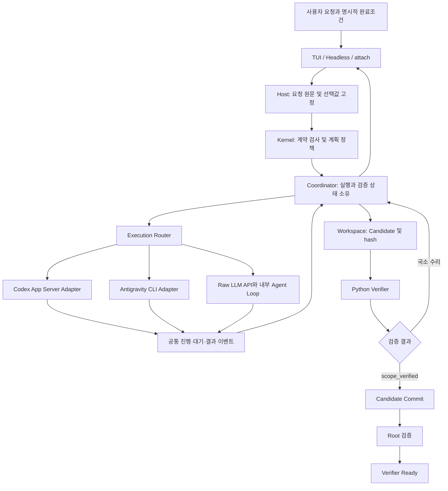

# Base Harness 외부 실행 신뢰성 개선 명세서

- 문서 ID: BH-EXTERNAL-RUNTIME-RELIABILITY-2026-09-14
- 작성일: 2026-09-14, Asia/Seoul
- 상태: 구현 제안 및 수용 기준. 이 문서의 요구사항은 아직 구현 완료를 의미하지 않는다.
- 적용 대상: Base Harness의 외부 실행 어댑터, 계획 입력 경계, Coordinator 연동, 공통 상태 표시.
- 주요 실행 대상: 설치된 Antigravity CLI와 Codex App Server.
- 비교 대상: 기존 Raw LLM API 실행 경로.
- 작업 유형: 로컬 파일 생성, 로컬 데이터 변환, 작은 개발 작업.
- 저장소: `C:/Users/doo33/Downloads/base_harness`.
- 설계 원칙: 현재 Kernel, Coordinator, Workspace, Python Verifier의 권한 경계를 유지한다.

## 1. Situation: 현재 확인된 사실

### 1.1 이번 수정에서 해결할 질문

사용자가 하나의 작업을 지시했을 때, 선택한 실행 백엔드가 실제로 그 작업을 수행하고, 하네스가 원래 요구와 결과를 연결하여 완료 여부를 결정할 수 있어야 한다.

성공 판정은 다음 세 가지를 별도로 기록해야 한다.

| 판정 | 의미 | 이것만으로 알 수 없는 것 |
| --- | --- | --- |
| 연결 성공 | 선택된 백엔드와 모델로 요청을 보낼 수 있다. | 작업 실행 및 파일 반영 성공 여부 |
| 실행 파이프라인 완료 | 계약, 실행, Candidate 검증, Commit, Root 검증이 종료됐다. | 계약이 사용자 요구를 정확하게 보존했는지 |
| 원래 요구 충족 | 실제 결과가 변경되지 않은 사용자 요구 및 명시된 완료조건과 일치한다. | 다른 종류의 작업이나 환경에서의 안정성 |

모델의 완료 발언, 프로세스 exit code 0, 파일 존재, Ready 이벤트 중 어느 하나만으로 세 판정을 모두 성공으로 표시해서는 안 된다.

### 1.2 근거 상태 구분

| 표기 | 의미 |
| --- | --- |
| 확인 | 실행 로그 또는 저장된 산출물에서 직접 관찰했다. |
| 코드 확인 | 조사 당시 로컬 코드에 해당 동작이 존재했다. 모든 환경의 재현까지 의미하지 않는다. |
| 가설 | 원인 후보이며 해당 실행의 직접 원인이라는 증거는 부족하다. |
| 미검증 | 성공 또는 실패를 판단할 실행 근거가 부족하다. |
| 로컬 수정 | 이전 실험 중 수정이 적용됐다. 일반 회귀 및 배포 완료와는 다르다. |

### 1.3 실행별 근거

| ID | 관찰 | 근거 상태 | 해석 |
| --- | --- | --- | --- |
| OBS-01 | Agy가 Markdown 파일을 생성하고 Candidate, Commit, Root Ready까지 진행했다. | 확인 | 적어도 한 가지 단순 작업의 전체 실행 경로는 연결돼 있다. |
| OBS-02 | 위 작업의 최초 상태부터 첫 Ready까지 약 367.4초, worker 시작까지 약 350.7초가 걸렸다. | 확인 | 이번 실행의 대기 시간은 준비 구간에 집중됐다. 원격 모델 처리 시간과 로컬 오버헤드는 아직 분리 측정되지 않았다. |
| OBS-03 | Agy 어댑터는 stdout과 stderr 전체를 읽고 프로세스 종료를 기다린 뒤 stream 이벤트를 해석했다. | 코드 확인 | 중간 진행을 사용자와 Coordinator에 전달하지 못하는 원인이 된다. 침묵 자체가 worker 정지의 증거는 아니다. |
| OBS-04 | 외부 planning 응답 처리에서 `EXTERNAL_PLANNING_PROTOCOL_INVALID`가 발생했다. | 확인 | 원본 응답 형식 오류와 수집·추출 오류를 분리할 진단이 필요하다. |
| OBS-05 | 일부 실패 출력은 `BadRequest` 또는 `AGY_RUN_FAILED` 수준으로 축약됐다. | 확인 | 출력만으로 인증, 요청, 서비스, 프로세스 오류를 구별하기 어렵다. |
| OBS-06 | `share subscriber failed`에서 외부 모델에 대한 `ProviderModelNotFoundError`가 발생했다. | 확인 | 공유 구독자의 내부 Provider 의존이 남아 있다. 같은 오류 이후 worker가 진행한 사례도 있어 전체 실패의 직접 원인으로 단정하지 않는다. |
| OBS-07 | Codex worker가 running 상태에서 충분한 후속 진단을 남기지 못한 실행이 있었다. | 확인 | 정지, 원격 대기, 승인 대기, 종료 신호 누락 중 무엇이었는지 확정할 수 없다. |
| OBS-08 | 조사한 Codex 실행 루프에는 서버발 승인 요청에 응답하는 분기가 없었다. | 코드 확인 | 프로토콜 지원 범위를 확인해야 한다. OBS-07의 직접 원인이 승인 대기였다는 것은 가설이다. |
| OBS-09 | Windows managed workspace 정리에서 `EBUSY`가 발생했고, 프로세스 종료를 기다리는 로컬 수정이 적용됐다. | 로컬 수정 | 이미 적용된 수정을 보존하고 수명주기 회귀 시험에 포함한다. |
| OBS-10 | Google API 요청이 모델 이용 불가 404 및 quota 관련 429로 거부됐다. | 확인 | 당시 계정·서비스 조건이다. Coordinator 수정으로 quota를 복구할 수는 없다. |
| OBS-11 | 등록된 verifier가 없는 Claim 때문에 계약이 거부됐다. | 확인 | 계획 작성자가 실제 검증 가능 범위를 알아야 한다. MetaReview pass는 verifier 등록을 대체하지 못한다. |
| OBS-12 | Headless 실행에서 `awaiting_input`이 발생하고 작업이 실행 완료로 이어지지 않았다. | 확인 | 질문이 필요한 상태의 표시, 보존, 재개 계약이 필요하다. 질문이 필요했다는 사실 자체는 결함이 아니다. |
| OBS-13 | 단일 파일 성공 실행의 child 및 root 내용 검증 predicate가 모두 `content_contains`였다. | 확인 | 원문의 정확한 내용 일치 요구보다 약한 조건으로 검증됐다. |
| OBS-14 | 위 Evidence의 OS, arch, runtime, configHash, workspaceRevision 등에 `current`가 저장됐다. | 확인 | 실행 환경을 실제로 식별하는 provenance로 사용할 수 없다. |
| OBS-15 | CLI에 명시한 `--agent general`이 primary agent가 아니라는 경고 후 기본 agent로 대체됐다. | 확인 | 도메인, 내부 역할, 외부 모델 선택을 분명히 구분해야 한다. |

### 1.4 기존 성공 평가의 정정

Agy smoke 실행에 보낸 요구는 파일의 정확한 내용 일치였다. 실제 생성된 파일에는 `Base Harness Antigravity smoke test`가 기록됐고, 저장된 child/root Evidence는 `content_contains`를 사용했다.

원문에 포함된 문장부호 및 줄바꿈의 해석은 명시적인 테스트 입력으로 고정해야 한다. 어떤 해석을 적용하더라도, 정확한 내용 일치를 부분 문자열 포함으로 바꾼 검증은 동등하지 않다.

따라서 이 실행은 다음과 같이 평가한다.

- 외부 백엔드 호출과 파일 반영: 확인.
- Candidate 및 Root 검증까지의 상태 전이: 확인.
- 원래 요구를 손실 없이 보존한 완료 판정: 개선 필요.
- 컴파일 오류 감지, 국소 수리, 복합 작업 안정성: 이 실행으로는 미검증.
- 외부 실행 전체가 사용 불가능하다는 결론: 이 실행 근거로 지지되지 않음.
- 외부 실행이 일반적으로 안정적이라는 결론: 한 번의 성공으로 지지되지 않음.

## 2. Reason: 수정 목표와 우선순위

### 2.1 목표

| 목표 ID | 우선순위 | 목표 | 완료를 보여 주는 증거 |
| --- | --- | --- | --- |
| GOAL-01 | P0 | 사용자 요구를 계약과 검증에 보존한다. | 정확한 내용, 제외 경로, 필수 결과를 약화한 계약이 실행 전에 거부된다. |
| GOAL-02 | P0 | 원래 오류와 실패 단계를 끝까지 보존한다. | 모든 실패 fixture에서 안정적인 code, 원인 참조, 실행 상관관계가 유지된다. |
| GOAL-03 | P0 | 외부 실행의 진행·대기·종료를 구분한다. | 정상 지연, 질문 대기, 통신 종료, timeout이 서로 다른 상태로 관측된다. |
| GOAL-04 | P0 | 미확정 실행을 중복 수행하거나 성공으로 처리하지 않는다. | 응답 유실 및 종료 경쟁 상황에서도 중복 mutation과 부당한 Ready가 없다. |
| GOAL-05 | P1 | 백엔드 식별과 내부 Provider 조회를 분리한다. | 외부 실행 fixture에서 내부 Provider 조회가 호출되지 않는다. |
| GOAL-06 | P1 | 실제 verifier 및 런타임 능력에 맞는 계획만 수용한다. | 지원되지 않는 predicate, 권한, 출력 방식이 첫 mutation 전에 거부된다. |
| GOAL-07 | P1 | TUI, Headless, attach가 동일한 결과를 표시하고 재개한다. | 동일 이벤트의 phase, outcome, failureId, 입력 대기 상태가 일치한다. |
| GOAL-08 | P2 | 단순 작업의 준비 비용과 불필요한 재검증을 줄인다. | 모델 대기와 로컬 비용을 분리한 측정 및 동일 결과를 유지하는 회귀 시험을 통과한다. |

P0는 오류 은폐, 요구 손실, 중복 실행 및 잘못된 완료 판정에 관한 우선순위다. 새로운 제품 계층을 먼저 추가하는 순서를 뜻하지 않는다.

### 2.2 범위

이번 명세의 구현 범위는 다음과 같다.

- 기존 외부 실행 어댑터의 상태·오류·종료 계약.
- 계약 입력의 원문 연결과 정형 요구 보존.
- 계획 생성의 schema 및 verifier capability 연결.
- Coordinator의 invocation 수명주기, 결과 수용 및 취소 처리.
- TUI, Headless, attach의 상태 렌더링과 기존 Question/Permission Service 연동.
- 위 동작을 검증하는 로컬 fixture 및 제한된 실제 서비스 시험.

후속 범위는 다음과 같다.

- CTF 문제 해결 능력 및 특정 도메인의 작업 전략.
- 새로운 OS sandbox 구현과 독립 설치 번들.
- 새로운 메타 검증 에이전트 계층 또는 다중 모델 투표.
- Evidence 신뢰 단계와 memory 생명주기 재설계.
- 새로운 외부 백엔드 및 모델별 수작업 reasoning 목록.
- 기존 저장소 전체 리팩터링과 TUI 디자인 교체.

## 3. Action: 권한과 모듈 책임

### 3.1 유지할 불변 조건

| ID | 요구사항 |
| --- | --- |
| INV-01 | Kernel은 계약·도메인·계획 정책의 결정만 담당하며 직접 프로세스나 모델을 실행하지 않는다. |
| INV-02 | Run, scope, worker, repair 및 verifier 수명주기의 유일한 소유자는 Coordinator다. |
| INV-03 | 외부 모델, 도구, MCP, plugin의 출력은 비신뢰 입력이다. 출력 문자열로 Evidence, FailureEnvelope 또는 Ready 권한을 얻을 수 없다. |
| INV-04 | Python verifier만 trusted Evidence와 Ready를 생성한다. |
| INV-05 | 계약이 승인되지 않았거나 필수 입력이 미해결이면 mutation을 시작하지 않는다. |
| INV-06 | 외부 CLI의 성공 응답은 Candidate 준비 조건이며, workspace Commit 승인은 아니다. |
| INV-07 | Commit은 현재 Candidate의 revision, patch hash, scope attestation 및 base hash 일치가 필요하다. |
| INV-08 | protocol, verifier, workspace conflict 및 미확정 실행 오류를 구현 코드 수리로 보내지 않는다. |
| INV-09 | 명시적으로 선택된 모델 또는 백엔드를 다른 모델이나 유료 API로 묵시적으로 대체하지 않는다. |
| INV-10 | 기존 로컬 수정과 `net_monitor.py`를 보존한다. |
| INV-11 | stdout 진행 이벤트, heartbeat, MetaReview pass는 Evidence 강도를 올리지 않는다. |
| INV-12 | 새 어댑터나 호환 코드에 두 번째 Coordinator 또는 전역 run 상태 저장소를 만들지 않는다. |

### 3.2 목표 구조



이 구조의 독립성은 코드의 책임과 실행 계약을 분리한다는 뜻이다. 모든 백엔드를 별도 상주 서버로 만들라는 요구가 아니다.

### 3.3 책임표

| 구성요소 | 소유하는 것 | 소유하지 않는 것 |
| --- | --- | --- |
| Host 입력 경계 | 사용자 원문, typed 선택값, 입력 식별자, 기존 권한 서비스 연결 | 모델 출력의 진실 판정 |
| Kernel | source 연결, 요구 보존 규칙, 계획 필요 여부, 지원 가능성 검사 | CLI 인자 조립, stdout parser, 인증 |
| Coordinator | invocation, phase, deadline, scope, scheduler, result 수용, repair routing | 모델 이름 추측, 모델별 출력 문법 |
| Backend Router | typed 선택값을 등록된 어댑터에 연결 | fallback 모델의 임의 선택 |
| Agy Adapter | 설치 CLI capability, 요청 직렬화, stream 해석, 프로세스 종료 | Evidence 승격, workspace 직접 Commit |
| Codex Adapter | 설치 버전 RPC 계약, 세션/turn, 서버발 요청, 알림 및 종료 처리 | 요청의 자동 승인 정책 결정 |
| Workspace 패키지 | managed workspace, 변경 검출, Candidate, Commit journal | 작업 성공의 의미적 판단 |
| Python Verifier | 실제 predicate 검사, Evidence, scope attestation, Root Ready | 모델의 자연어 실패 재분류 |
| TUI / Headless | 상태 렌더링, 사용자 응답 전달, terminal outcome 표시 | 자체 verifier, 독립 retry 및 Ready 판정 |

## 4. 정형 선택값과 capability 계약

아래 TypeScript는 제안 계약이다. 기존에 구현돼 있다고 해석해서는 안 된다.

### 4.1 실행 대상의 단일 정규형

```ts
type ExecutionTarget =
  | {
      kind: "model_api"
      connectionId: string
      providerId: string
      modelId: string
      nativeOptions: Record<string, string>
      capabilityRevision: string
    }
  | {
      kind: "agent_runtime"
      connectionId: string
      backendId: "antigravity-cli" | "codex-app-server"
      modelId: string
      nativeOptions: Record<string, string>
      capabilityRevision: string
    }
```

| ID | 요구사항 |
| --- | --- |
| SEL-01 | 선택값은 Host에서 한 번 정규화하고 해당 invocation의 manifest에 고정한다. |
| SEL-02 | 모든 소비자는 `kind`로 분기한다. provider 문자열의 prefix로 실행 종류를 추측하지 않는다. |
| SEL-03 | 외부 런타임의 `modelId`는 해당 CLI가 반환한 식별자를 그대로 보존한다. |
| SEL-04 | 추론 수준은 해당 모델의 capability 또는 명시적 provider 설정에 나온 값만 허용한다. |
| SEL-05 | 모델 ID의 high, low, max 같은 접미사를 해석해 별도 effort 인자를 생성하지 않는다. |
| SEL-06 | 옵션 목록을 받지 못하면 `unavailable`로 표시한다. 임의 기본 effort를 만들어 보내지 않는다. |
| SEL-07 | 연결 종류, 모델, 옵션 조합을 검사한 후 첫 모델 요청을 보낸다. |
| SEL-08 | 실행 중 선택값 변경은 다음 run에 적용한다. 기존 worker의 모델을 조용히 변경하지 않는다. |
| SEL-09 | 재개 시 저장된 capability revision을 확인하고 변경이 있으면 옵션을 재검증한다. |
| SEL-10 | 인증은 외부 CLI의 정상 인증 경로를 사용한다. 다른 제품의 token 파일을 복사해 Provider API credential로 사용하지 않는다. |

### 4.2 Capability 내용

| 필드 | 용도 |
| --- | --- |
| backendId, backendVersion | 실행 백엔드와 설치 버전 식별 |
| discoverySource | 실제 CLI/RPC 응답 또는 명시적 설정의 출처 |
| discoveredAt, revision | 조회 시점 및 정규화한 capability hash |
| models | 실제 선택 가능한 모델 ID |
| perModelOptions | 모델별 옵션 이름, 허용 값, 광고된 기본값 |
| structuredOutput | native schema, terminal text, 지원 안 함, 확인 안 됨 |
| progressEvents | 실제로 지원되는 진행 이벤트 종류 |
| interactiveRequests | 실제로 처리 가능한 질문·승인 요청 종류 |
| resume | 같은 외부 세션/turn 재개 지원 여부 |
| cancellation | 지원하는 중단 방식 및 종료 확인 방법 |
| containment | 해당 실행 환경이 실제로 보장하는 경계 |

- capability hash는 정규화한 의미 있는 필드에 대해 계산한다.
- timestamp, 배너, 출력 순서 변경만으로 선택값을 stale 처리하지 않는다.
- 캐시는 연결·백엔드 버전별로 관리하고 기본 TTL 제안값은 300초다.
- 인증 변경, 모델 미존재 응답, 버전 변경은 즉시 재조회 사유다.
- `--help` 텍스트만으로 기계 계약을 알 수 없는 경우 지원 상태를 unknown으로 남긴다.
- capability 확인 실패가 다른 모델로의 fallback 허가는 아니다.

### 4.3 기존 가상 Provider 호환

- 이전 `external/*` 값은 입력 또는 저장 자료를 읽는 호환 경계에서만 해석한다.
- 정규화 이후 내부 Provider registry로 전달하지 않는다.
- 변환할 백엔드·모델을 식별할 수 없으면 `LEGACY_EXECUTION_SELECTION_UNRESOLVED`로 중단한다.
- 공유·통계·세션 제목 같은 부가 모듈은 Host가 제공하는 backend display metadata를 사용한다.
- 해당 부가 기능을 지원하지 않으면 구조화된 warning을 기록한다.
- 부가 구독자의 모델 조회 실패를 Root 작업 실패로 승격하지 않는다.
- 필수 보안 검사 또는 필수 durable 저장의 실패는 부가 warning으로 격하하지 않는다.

## 5. 사용자 요구 보존과 계약 수용

### 5.1 Host가 보관할 입력

```ts
interface RequestBasis {
  requestId: string
  sourceMessageId: string
  sourceTextHash: string
  protectedRequirements: ProtectedRequirement[]
}

interface ProtectedRequirement {
  id: string
  sourceRef: {
    messageId: string
    start: number
    end: number
    quoteHash: string
  }
  origin: "user_structured" | "source_confirmed" | "model_proposed"
  constraint:
    | {
        type: "exact_text"
        path: string
        expectedText: string
        encoding: "utf8"
        newlinePolicy: "exact" | "allow_one_trailing_newline"
        bomPolicy: "forbid" | "allow"
      }
    | {
        type: "write_paths"
        allowedPaths: string[]
      }
    | {
        type: "required_artifact"
        path: string
      }
}
```

`model_proposed` 요구는 원문과의 연결을 검사하기 전까지 Host가 보증한 요구로 취급하지 않는다. 원문 오프셋이 유효하다는 것만으로 의미적 해석이 정확하다고 보증하지 않는다.

### 5.2 구체적인 보존 규칙

| ID | 요구사항 |
| --- | --- |
| REQ-01 | 원문 메시지와 hash는 계약 revision과 별개로 보존한다. 계약 재작성으로 원문을 덮어쓰지 않는다. |
| REQ-02 | 정확한 내용 일치 요구를 `content_contains` 또는 `exists`만으로 커버한 계약은 거부한다. |
| REQ-03 | `exact_text`는 `content_equals` 또는 원래 기대 bytes에 연결된 동일 강도 검증으로 구현한다. |
| REQ-04 | expected value를 모델이 요약하거나 문장부호를 삭제해서 바꾸지 못하게 한다. |
| REQ-05 | 줄바꿈, BOM, 인코딩 허용 범위를 입력 계약에 명시한다. verifier가 임의 trim을 적용하지 않는다. |
| REQ-06 | 허용 변경 경로는 Candidate 전체 변경 목록과 비교한다. 선언된 결과 파일 하나만 확인하는 것으로 대체하지 않는다. |
| REQ-07 | source requirement, criterion, claim, verifier predicate의 연결을 검사하고 미연결 필수 요구가 있으면 실행하지 않는다. |
| REQ-08 | 단순한 protocol repair가 사용자의 요구, 위험도, 제외 범위를 변경할 수 없다. |
| REQ-09 | 필수 조건을 구현할 verifier가 없으면 `VERIFIER_CAPABILITY_UNAVAILABLE`로 표시한다. 약한 검사로 대체하지 않는다. |
| REQ-10 | 의미적 모호성이 실제 결과에 영향을 주면 기존 Question Service로 연결한다. 답이 없는 상태를 동의로 해석하지 않는다. |
| REQ-11 | 테스트 runner가 생성하는 실행 로그는 actor workspace 밖에 저장하여 경로 제약과 변경 검출을 오염시키지 않는다. |
| REQ-12 | 파일 단위 검사는 실제 실행 환경을 Host가 기록한다. `current`를 OS·버전·hash의 실제 값으로 저장하지 않는다. |

### 5.3 정확한 텍스트 fixture

```json
{
  "path": "result.txt",
  "expectedText": "Base Harness Antigravity smoke test.",
  "encoding": "utf8",
  "newlinePolicy": "exact",
  "bomPolicy": "forbid",
  "allowedChangedPaths": ["result.txt"]
}
```

다음 결과는 모두 거부해야 한다.

- 마침표가 없는 결과.
- 기대 문자열 앞뒤에 다른 설명이 붙은 결과.
- exact 정책에서 끝에 줄바꿈이 추가된 결과.
- BOM 금지 정책에서 BOM이 추가된 결과.
- 내용은 맞지만 다른 파일이 추가·수정·삭제된 결과.
- `content_contains`만 통과시킨 결과.
- 결과가 맞더라도 선택된 Candidate와 다른 revision의 attestation을 사용한 경우.

### 5.4 자연어 요구에 대한 보장 한계

하네스가 임의의 자연어에서 모든 의도를 결정론적으로 추출할 수 있다고 가정하지 않는다.

정형 입력과 고정 fixture는 기계적으로 보존한다. 자연어 입력에서는 LLM이 의미적 후보를 만들고 기존 Preflight·MetaReview가 검토하되, 원문 연결 및 허용된 정형 변환은 코드로 검사한다.

영문·한국어 키워드의 `includes()` 결과만으로 exact 여부, 권한, retry, risk 또는 질문 필요성을 결정하는 구현은 허용하지 않는다.

## 6. Verifier capability와 계획 생성

### 6.1 Verifier capability descriptor

Host는 다음 정보를 계획 작성기에 제공한다.

| 필드 | 내용 |
| --- | --- |
| verifierId | 실제 등록된 verifier ID |
| revision | 적용되는 검증기 revision |
| supportedClaimKinds | 해당 검증기가 처리하는 Claim 종류 |
| supportedPredicates | predicate 종류와 각 입력 schema |
| strength | structural, execution 등 실제 강도 |
| applicability | 필요한 OS, runtime, tool 및 환경 |
| requiredInputs | 파일, 명령, fixture, expected result 등의 필수 입력 |
| availability | available, unavailable 및 reason code |

- descriptor는 실제 verifier 등록소에서 산출한다.
- TS 프롬프트 문서와 Python verifier의 목록을 사람이 별도로 관리하지 않는다.
- 첫 단계에서는 동일 verifier 배포 산출물에 포함한 descriptor를 Host port로 공급한다.
- descriptor는 계획 힌트이며 실제 verifier의 계약 수용 검사를 대체하지 않는다.
- mutation 전 기존 sidecar 계약 수용 경로로 실제 지원 여부를 확인한다.
- descriptor와 실제 검증기가 불일치하면 `VERIFIER_CAPABILITY_MISMATCH`로 거부한다.
- 존재하지 않는 sidecar 메서드나 외부 서비스의 schema 옵션을 이미 지원한다고 가정하지 않는다.

### 6.2 계획 단계 분리

| 순서 | 산출물 | 강제 조건 |
| --- | --- | --- |
| 1 | RequestBasis | 원문 및 명시적 요구를 Host가 보존한다. |
| 2 | ContractProposal | 실제 verifier capability와 연결한다. |
| 3 | Contract Preflight | source 연결, predicate 강도, 적용 환경을 검사한다. |
| 4 | 선택적 Contract MetaReview | 기존 정책에 따라 호출한다. |
| 5 | PlanningDecision | Kernel이 direct 또는 planned를 결정한다. |
| 6 | PlanSpec 및 WorkGraph | planned일 때 승인된 계약에 대해서만 만든다. |
| 7 | Plan MetaReview | 기존 bounded 검토를 유지한다. |
| 8 | 실행 | 현재 승인 revision과 일치하는 경우에만 시작한다. |

처음부터 모든 외부 작업에 거대한 Contract와 WorkGraph JSON을 동시에 요구하는 경로는 이 순서에 맞게 분리한다.

### 6.3 응답 schema와 repair

| ID | 요구사항 |
| --- | --- |
| PLN-01 | 설치 버전이 native structured output을 지원하면 검증된 해당 기능을 사용한다. |
| PLN-02 | 지원하지 않으면 명시된 terminal response 채널에서만 JSON을 읽는다. |
| PLN-03 | tool output, reasoning, progress, stderr에 섞인 JSON을 계획 결과로 사용하지 않는다. |
| PLN-04 | 종료되지 않은 stream이나 잘린 frame을 모델의 JSON 형식 오류로 분류하지 않는다. |
| PLN-05 | schema 오류는 pointer, expected type, 실제 타입 요약 및 안정적인 error code로 보관한다. |
| PLN-06 | 수정 요청에는 최대 5개 schema 오류와 변경 불가 요구 ID를 전달한다. 임의 장문 오류 전체를 프롬프트에 넣지 않는다. |
| PLN-07 | 완료된 모델 응답의 schema repair는 최초 요청 후 최대 1회다. transport 재시도와 별도 집계한다. |
| PLN-08 | repair가 필수 criterion, target, expected value 또는 검증 강도를 약화하면 거부한다. |
| PLN-09 | unsupported predicate와 schema 오타를 구분한다. verifier 미지원은 JSON 재출력만으로 해결됐다고 처리하지 않는다. |
| PLN-10 | MetaReview pass 후에도 deterministic 계약 검사를 생략하지 않는다. |
| PLN-11 | 일반 구현 실패는 기존 local repair로 보낸다. 계약 전체 재작성은 typed revalidation trigger가 있을 때만 한다. |
| PLN-12 | 로그에 phase별 모델 요청 횟수와 각 repair 이유를 기록한다. |

### 6.4 Direct 경로의 정의

Direct는 계획용 WorkGraph 및 LLM 구현 subagent를 생략할 수 있다는 의미다. 계약 승인, 변경 경계, Candidate 통제 또는 Root 검증을 생략하는 의미가 아니다.

외부 direct 실행도 managed workspace에서 결과를 수집한다. Coordinator가 root에 속한 단일 실행 scope를 관리하고 기존 Candidate 검증 경로에 연결한다. 이를 위해 모델이 형식적인 WorkGraph를 추가로 생성하도록 요구하지 않는다.

초기 안정화에서는 현재 작동하는 planned 경로를 기준선으로 유지한다. Direct 최적화는 동등한 검증 결과와 변경 경계가 확인되는 후속 단계에서 활성화한다.

하나의 파일 내용 검사가 파일 존재까지 포함하는 경우 중복 검사와 claim 분해를 줄일 수 있다. 이때 원래 required criterion의 출처와 coverage는 모두 유지한다.

## 7. 공통 invocation과 이벤트 계약

### 7.1 Invocation 식별

```ts
interface RuntimeInvocation {
  invocationId: string
  runId: string
  scopeId: string
  workUnitId?: string
  stage:
    | "contract"
    | "contract_review"
    | "plan"
    | "plan_review"
    | "implementation"
    | "repair"
  attempt: number
  generation: number
  requestId: string
  contractRevision: number
  target: ExecutionTarget
}
```

- run은 사용자 작업 전체, invocation은 하나의 외부 실행 호출을 식별한다.
- attempt는 명시적으로 승인된 재시도를 식별한다.
- generation은 취소·새 revision 이후 오래된 이벤트를 차단한다.
- 외부 thread/session/turn ID는 별도 필드로 연결한다.
- Host invocation ID와 외부 session ID를 같은 것으로 가정하지 않는다.

### 7.2 이벤트 봉투

```ts
interface RuntimeEvent {
  schemaVersion: 1
  eventId: string
  runId: string
  scopeId: string
  invocationId: string
  attempt: number
  generation: number
  sequence: number
  observedAt: string
  source: "host" | "runtime"
  nativeEventType?: string
  payload: RuntimeEventPayload
}

type RuntimeEventPayload =
  | { type: "invocation.started"; stage: RuntimeInvocation["stage"] }
  | { type: "request.accepted"; externalSessionId?: string; externalTurnId?: string }
  | { type: "progress"; category: "message" | "tool"; summary: string }
  | { type: "response.delta"; text: string }
  | { type: "input.required"; requestId: string; requestKind: "question" | "permission" }
  | { type: "input.resolved"; requestId: string }
  | { type: "heartbeat"; origin: "host"; processAlive?: boolean }
  | { type: "output.truncated"; stream: "stdout" | "stderr" | "progress"; omittedBytes: number }
  | { type: "terminal"; resultId: string }
  | { type: "failure"; failureId: string }
  | { type: "cleanup.warning"; diagnosticRef: string }
```

### 7.3 이벤트 처리 규칙

| ID | 요구사항 |
| --- | --- |
| EVT-01 | stdout/stderr를 프로세스 실행 중 지속적으로 읽는다. 최종 결과 수집 때문에 pipe 소비를 멈추지 않는다. |
| EVT-02 | frame은 여러 chunk로 나뉠 수 있고 한 chunk에 여러 frame이 들어올 수 있다. |
| EVT-03 | UTF-8 문자가 chunk 경계에서 잘려도 스트리밍 decoder로 복원한다. |
| EVT-04 | transport framing과 모델 응답 JSON schema 검사를 서로 다른 단계로 분리한다. |
| EVT-05 | 중복 이벤트는 event ID 또는 명시된 native ID로 제거한다. 텍스트가 같다는 이유만으로 제거하지 않는다. |
| EVT-06 | Host가 sequence를 부여하며, 도착한 오래된 generation은 상태 변경 없이 진단에 남긴다. |
| EVT-07 | 상태 전이와 terminal 이벤트는 durable 저장 후 UI로 전달한다. |
| EVT-08 | UI 재접속은 snapshot과 cursor 이후 이벤트를 결합한다. display cache가 실행 권한을 갖지 않는다. |
| EVT-09 | 외부 프로그램이 반환한 Evidence/Ready 모양 JSON은 일반 출력 데이터로 취급한다. |
| EVT-10 | 모델의 비공개 reasoning 전문은 수집 요구사항이 아니다. phase와 공개 progress로 상태를 설명한다. |
| EVT-11 | heartbeat는 Host가 살아 있다는 사실만 나타낸다. 모델이 진행 중이라는 증거로 표시하지 않는다. |
| EVT-12 | terminal 이벤트 전 stdout EOF는 성공으로 처리하지 않는다. |

## 8. 상태 머신과 대기 상태

### 8.1 외부 호출 상태

```text
created
 -> capability_check
 -> workspace_preparing
 -> starting
 -> request_sent
 -> running
 -> terminal_received
 -> output_draining
 -> process_stopped
 -> candidate_preparing
 -> settled

running -> awaiting_input -> running
running -> cancelling -> cancelled
각 단계 -> failed
request_sent 이후 결과 불명 -> outcome_unknown
```

### 8.2 Coordinator 상태와의 관계

- Adapter는 외부 호출 상태를 보고한다.
- Coordinator가 run 및 worker 상태로 투영한다.
- `terminal_received`는 worker completed가 아니다.
- 성공한 실행의 결과 수집과 종료 확인 후에만 Candidate를 준비한다.
- scope 검증과 Commit이 성공한 후 worker completed가 된다.
- 필수 criterion이 모두 충족되고 Root verifier가 승인한 후에만 Ready가 된다.

### 8.3 WaitingReason

| 값 | 의미 | 사용자 표시 |
| --- | --- | --- |
| provider_response | 요청 수락 후 모델 응답 대기 | 응답 대기 및 경과 시간 |
| external_tool | 외부 런타임 도구 작업 진행 | 확인 가능한 도구 종류 및 경과 시간 |
| user_question | 사용자 결정이 필요 | 질문 대기 |
| permission_request | 기존 권한 정책 또는 사용자 응답이 필요 | 권한 요청 대기 |
| process_exit | 결과를 받은 뒤 프로세스 종료 대기 | 종료 처리 중 |
| candidate_capture | 변경 결과 수집 중 | 결과 수집 중 |
| verifier | 독립 검증 중 | 검증 중 |
| unknown | 대기 원인을 식별하지 못함 | 원인 미확인 대기 |

`unknown`을 `working normally`로 바꾸거나 일정 시간 침묵했다고 곧바로 `deadlocked`로 표시하지 않는다.

### 8.4 제한 시간 기본값 제안

| 단계 | 안내 기준 | hard deadline | 비고 |
| --- | --- | --- | --- |
| capability 조회 | 5초 | 20초 | 읽기 전용 확인만 제한된 재시도 허용 |
| process/session 초기화 | 10초 | 30초 | 요청 전 실패와 요청 후 실패를 구별 |
| Contract 또는 Plan 생성 | 60초 | 호출당 300초 | soft threshold는 실패 판정이 아님 |
| MetaReview | 60초 | 호출당 300초 | 기존 bounded repair 횟수 유지 |
| Worker 실행 | 120초 | 호출당 900초 | 작업별 명시적 상한 조정 가능 |
| graceful 종료 | 즉시 상태 표시 | 5초 | 해당 invocation의 프로세스만 대상 |
| 강제 종료 확인 | 즉시 상태 표시 | 추가 10초 | 종료 불명확 시 성공 결과를 수용하지 않음 |
| 전체 활성 run | phase별 표시 | 1800초 | 사용자 입력 대기 시간은 별도로 계산 |

- hard deadline은 monotonic clock으로 관리한다.
- heartbeat나 중복 progress 이벤트로 hard deadline을 연장하지 않는다.
- 정상 침묵만으로 fail 또는 자동 재시도를 발생시키지 않는다.
- 30초 이상 실제 runtime 이벤트가 없으면 해당 사실을 UI에 표시한다.
- 사용자 입력 대기 중에도 cancel은 즉시 수용한다.
- 위 값은 구현의 명시적 기본값 제안이며, 제공자의 응답 시간 SLA가 아니다.

## 9. 백엔드별 처리 요구사항

### 9.1 Antigravity CLI

| ID | 요구사항 |
| --- | --- |
| AGY-01 | 설치된 CLI가 광고한 모델 및 옵션을 사용한다. 외부 모델을 내부 Provider에 재등록하지 않는다. |
| AGY-02 | stream-json을 줄 단위로 즉시 읽어 정상화된 이벤트를 전달한다. |
| AGY-03 | stderr는 별도로 읽고 redacted 진단으로 보존한다. stdout JSON에 합치지 않는다. |
| AGY-04 | terminal result의 상태, response, denied action, 프로세스 exit를 각각 검사한다. |
| AGY-05 | SUCCESS 문자열만으로 작업 성공 또는 Candidate 승인을 만들지 않는다. |
| AGY-06 | terminal event 없이 exit 0이면 `RUNTIME_TERMINAL_MISSING`으로 기록한다. |
| AGY-07 | 성공 terminal 후 비정상 exit가 발생하면 원인을 기록하고 결과 수용을 보류한다. |
| AGY-08 | planning, review, implementation의 native mode를 명시적으로 매핑하고 manifest에 남긴다. |
| AGY-09 | 외부 CLI의 plan 모드 이름만으로 read-only 보장을 주장하지 않는다. 현재 권한 및 실행 경계로 실제 허용 범위를 확인한다. |
| AGY-10 | 외부 runtime이 권한을 요청하면 기존 Host 정책으로 처리한다. 진행을 위해 자동으로 permission 우회 옵션을 추가하지 않는다. |
| AGY-11 | 재개를 지원하는 경우 동일 native session으로 연결한다. 지원하지 않으면 `contextContinuity=fresh`로 기록한다. |
| AGY-12 | native 재개 미지원 상태에서 기존 대화 문맥이 보존됐다고 보고하지 않는다. |
| AGY-13 | Windows와 WSL 선택은 명시된 연결 정보로 결정하고 실행 위치, cwd 변환 결과, 버전을 기록한다. |
| AGY-14 | terminal output의 임시 파일 링크를 사용자 결과물 링크로 그대로 노출하지 않는다. Commit 후 Host가 확인한 실제 경로를 제공한다. |

### 9.2 Codex App Server

| ID | 요구사항 |
| --- | --- |
| CDX-01 | 설치된 app-server 버전의 schema를 기준으로 요청, 응답, notification을 구분한다. 메서드명을 추측해 추가하지 않는다. |
| CDX-02 | 초기화, thread 생성, turn 시작 응답의 상관관계를 명시적으로 검사한다. |
| CDX-03 | 응답 ID만 기다리면서 도착한 notification 또는 서버발 요청을 버리지 않는다. |
| CDX-04 | 서버발 question/permission 요청은 기존 Host 서비스에 연결하고 동일 request ID로 응답한다. |
| CDX-05 | 알 수 없는 요청은 protocol이 정한 unsupported 응답과 Host 진단으로 처리한다. 조용히 무시하지 않는다. |
| CDX-06 | terminal notification 이름뿐 아니라 내부 turn status와 error 필드를 검사한다. |
| CDX-07 | 마지막 message가 delta가 아닌 completed item으로만 전달돼도 최종 출력이 보존돼야 한다. |
| CDX-08 | delta와 completed item을 모두 받은 경우 같은 최종 출력이 중복되지 않게 message identity로 결합한다. |
| CDX-09 | stdin, stdout, stderr, pending RPC, abort signal을 하나의 invocation 수명주기에 연결한다. |
| CDX-10 | pipe EOF, turn 실패, process exit, timeout을 구별해 서로 다른 code를 남긴다. |
| CDX-11 | 지원되는 취소 요청 후 필요하면 owned process tree 종료를 수행하고 실제 종료를 기다린다. |
| CDX-12 | 이전에 추가한 process exit 대기를 보존한다. 종료를 기다리기 전에 managed workspace를 지우지 않는다. |
| CDX-13 | 이전 worker 정지의 원인은 새 계측으로 확인한다. 승인 대기였다는 가설을 수정 효과의 증거로 사용하지 않는다. |
| CDX-14 | network 및 실행 권한은 승인된 실행 정책과 backend capability로 결정한다. 임의의 환경변수만으로 상향하지 않는다. |

## 10. FailureEnvelope와 진단 보존

### 10.1 호환 원칙

현재 FailureKind 및 Host 생성 권한을 유지한다. 새 runtime 진단은 Host envelope의 정형 details 또는 Host manifest에 연결하며, Python에서 자연어를 다시 분류하게 하지 않는다.

```ts
interface RuntimeFailureContext {
  invocationId: string
  stage: RuntimeInvocation["stage"]
  backendId: string
  modelId: string
  nativeCode?: string
  nativeStatus?: number
  nativeExitCode?: number
  nativeRequestId?: string
  requestDisposition:
    | "not_sent"
    | "sent_unacknowledged"
    | "accepted"
    | "terminal_received"
  causeFailureId?: string
  diagnosticRef?: string
  outputTruncated: boolean
}
```

### 10.2 실패 구분

| 안정적인 code | 기본 FailureKind | 처리 |
| --- | --- | --- |
| EXECUTION_SELECTION_INVALID | harness_error | 첫 요청 전 거부 |
| RUNTIME_CAPABILITY_UNAVAILABLE | harness_error | 연결 진단, 코드 수리 금지 |
| RUNTIME_AUTH_REQUIRED | model_provider_error | 인증 필요 상태 전달 |
| RUNTIME_MODEL_UNAVAILABLE | model_provider_error | 모델 재선택 필요, 임의 fallback 금지 |
| PROVIDER_RATE_LIMITED | model_provider_error | 구조화된 retry 지시 및 상한에 따름 |
| PROVIDER_QUOTA_UNAVAILABLE | model_provider_error | 계정 조건 표시, 반복 실행 금지 |
| RUNTIME_REQUEST_INVALID | harness_error | Host가 만든 요청이 설치 schema에 맞지 않을 때 |
| EXTERNAL_RESPONSE_SCHEMA_INVALID | model_protocol_error | 완전한 모델 응답의 schema 위반일 때만 |
| RUNTIME_FRAME_INVALID | harness_error | transport 또는 adapter framing 문제 |
| RUNTIME_TERMINAL_MISSING | harness_error | 종료 근거 부족, Candidate 수용 금지 |
| RUNTIME_STAGE_TIMEOUT | harness_error | 종료 요청 및 결과 불명 여부 확인 |
| RUNTIME_OUTCOME_UNKNOWN | unknown_failure | mutation 재시도 및 코드 repair 금지 |
| RUNTIME_OUTPUT_LIMIT_EXCEEDED | harness_error | 제한 초과 종료, 잘린 결과 수용 금지 |
| CONTRACT_REQUIREMENT_WEAKENED | harness_error | 모델 제안 반려, workspace mutation 금지 |
| VERIFIER_CAPABILITY_MISMATCH | verifier_error | verifier/descriptor 진단 |
| WORKSPACE_CONFLICT | workspace_conflict | 실제 workspace 덮어쓰기 금지 |
| RUNTIME_CLEANUP_INCOMPLETE | harness_error | 별도 cleanup 진단, 기존 원인 보존 |

오류 이름만 보고 위 표를 적용하지 않는다. code는 해당 조건을 Host가 확인한 경계에서 생성한다. 예를 들어 외부 provider가 자체적으로 반환한 invalid request와 Host schema 검사 실패는 같은 사건이 아니다.

### 10.3 원인 보존 규칙

| ID | 요구사항 |
| --- | --- |
| ERR-01 | 최초 오류, 후속 정리 오류 및 최종 사용자 상태를 연결하되 최초 원인을 덮어쓰지 않는다. |
| ERR-02 | 제공자가 준 구조화된 code, status, retry 지시와 request ID를 보존한다. |
| ERR-03 | CLI, Host API, TUI가 동일 failureId를 보여 준다. |
| ERR-04 | Host API가 자체 응답을 BadRequest로 분류해도 응답 body에는 안전하게 정제한 원래 failure reference를 유지한다. |
| ERR-05 | 실제 발생 위치를 알 수 없는 BadRequest를 Codex 자체 오류로 단정하지 않는다. |
| ERR-06 | raw stdout/stderr는 redaction을 거친 bounded artifact로 저장한다. 인증 토큰과 헤더를 원문 저장하지 않는다. |
| ERR-07 | 비신뢰 출력에 포함된 failureKind, retryable, terminal 값을 실행 정책으로 사용하지 않는다. |
| ERR-08 | 한국어·영어 message가 달라도 동일 typed cause이면 같은 분류와 fingerprint를 만든다. |
| ERR-09 | 문자열 heuristic은 unknown 진단 힌트로만 남긴다. 권한 상향, 코드 repair 또는 자동 재시도를 허가하지 않는다. |
| ERR-10 | cleanup warning을 model_provider_error로 잘못 분류하지 않는다. |

## 11. Retry, Repair, Replan의 분리

| 동작 | 목적 | 허용 조건 | 상한 |
| --- | --- | --- | --- |
| discovery retry | 읽기 전용 capability 확인 | 미전송 또는 부작용 없는 조회 | 최초 요청 후 최대 2회 |
| provider retry | 일시적인 제공자 거부 회복 | 구조화된 retry 지시와 실행 중복이 없다는 근거 | 최초 요청 후 최대 2회 |
| schema repair | 완료된 계획 응답 형식 수정 | transport가 정상 종료됐고 immutable 요구가 고정됨 | 최대 1회 |
| implementation repair | 실패 criterion에 해당하는 결과 수정 | 기존 trusted verifier rejection과 허용 경로 | 기존 동일 fingerprint 최대 2회 |
| foundational replan | 무효화된 계획 전제 갱신 | 기존 typed revalidation trigger | 기존 정책의 상한 |
| mutation replay | 동일 외부 작업 재실행 | 자동 허용 안 함. 결과 불명 상태는 먼저 해결 필요 | 기본 0회 |

- backoff 제안값은 1초, 2초의 기본 지연에 bounded jitter를 추가한다.
- 제공자의 Retry-After가 있으면 전체 deadline 내에서 우선 적용한다.
- scope별 횟수와 run 전체 모델 호출 상한을 모두 확인한다.
- 외부 API가 idempotency를 지원하지 않는 경우 Host request ID만으로 중복 실행이 방지된다고 주장하지 않는다.
- 요청 전 실패와 수락된 요청의 응답 유실을 구별한다.
- timeout 후 남아 있는 외부 작업이 종료됐는지 모르면 즉시 같은 mutation을 보내지 않는다.
- provider 오류를 수리하려고 작업 파일을 변경하지 않는다.

## 12. 결과 수용, Candidate 및 Commit

### 12.1 외부 실행 성공 조건

외부 실행 결과를 Candidate 후보로 수용하려면 다음 조건을 모두 만족해야 한다.

- 설치 schema에 맞는 성공 terminal result가 확인됐다.
- 실패나 취소 상태가 terminal payload 안에 숨겨져 있지 않다.
- 출력 framing과 최종 response 수집이 완료됐다.
- 요청 scope와 invocation generation이 현재 상태와 일치한다.
- 해당 invocation이 제어하는 프로세스 또는 세션이 더 이상 Candidate를 변경하지 않는다.
- 변경 목록 수집이 끝났으며 권한 밖 변경이 없다.
- 원래 요청과 승인된 계약 revision이 일치한다.

### 12.2 Candidate 조건

| ID | 요구사항 |
| --- | --- |
| CAN-01 | 변경 파일은 managed workspace의 실제 diff와 hash로 수집한다. 모델의 changedFiles 목록을 그대로 신뢰하지 않는다. |
| CAN-02 | 신규·수정·삭제·이름 변경 지원 범위를 capability에 명시한다. 미지원 변경을 무시하지 않는다. |
| CAN-03 | 허용 경로 밖 변경은 Candidate 거부 사유다. 결과 파일만 골라 성공으로 표시하지 않는다. |
| CAN-04 | base hash 변경은 workspace_conflict이며 사용자 변경을 덮어쓰지 않는다. |
| CAN-05 | Candidate revision과 patch hash가 attestation에 직접 연결돼야 한다. |
| CAN-06 | 검증 중 새 변경이 생기면 기존 attestation은 사용할 수 없다. |
| CAN-07 | metadata에 scope_verified라고 기록하는 것만으로 Commit할 수 없다. |
| CAN-08 | 외부 runtime의 자체 검증 결과는 참고 데이터다. 독립 verifier가 필요한 검사와 대체하지 않는다. |
| CAN-09 | 성공 후 반환하는 파일 링크는 실제 Commit 경로와 연결한다. |
| CAN-10 | read-only 요구도 외부 runtime의 실제 변경 여부를 확인하고 unexpected mutation을 거부한다. |

### 12.3 Root 완료와 중복 검증

Root Ready의 선행 조건은 다음과 같다.

- 필수 criterion이 미해결 상태가 아니다.
- 필수 WorkUnit이 모두 검증되고 Commit됐다.
- 필수 통합 단계가 종료됐다.
- pending tool, 미해결 input, outcome_unknown invocation이 없다.
- 원래 요청의 protected requirement가 그대로 보존돼 있다.
- Root verifier가 현재 결과에 대해 Ready를 발행했다.

동시에 들어온 completion 및 automatic verify 요청은 같은 scope, contract revision, artifact snapshot, verifier revision이면 하나의 진행 중 검증으로 결합한다.

파일 내용, 계약 또는 verifier revision이 바뀌면 새 검증으로 처리한다. 같은 파일을 여러 번 검사한 결과를 독립 증거 수의 증가로 사용하지 않는다. Evidence lifecycle 자체의 재설계는 이번 범위가 아니다.

## 13. 취소, 프로세스 종료 및 정리

| ID | 요구사항 |
| --- | --- |
| LIFE-01 | invocation마다 취소 signal, deadline, native session 및 owned process 정보가 연결돼야 한다. |
| LIFE-02 | cancel 수용 즉시 새 모델·도구 요청의 발행을 막는다. |
| LIFE-03 | 가능한 native cancel을 먼저 사용하고 필요하면 해당 invocation의 process tree를 종료한다. |
| LIFE-04 | 프로세스 이름으로 모든 agy, bun, node, python을 일괄 종료하지 않는다. |
| LIFE-05 | 취소 시점과 terminal 도착이 경쟁해도 결과 수용은 Coordinator의 한 번의 상태 전이로 결정한다. |
| LIFE-06 | 취소 후 늦게 도착한 성공 이벤트는 workspace Commit 및 Ready를 발생시키지 않는다. |
| LIFE-07 | 프로세스 종료와 output drain을 확인하기 전 managed workspace를 정리하지 않는다. |
| LIFE-08 | 정리 대상은 invocation manifest가 소유한 canonical 임시 경로로 한정한다. |
| LIFE-09 | 종료 여부가 불명확하거나 파일이 계속 변경되면 Candidate를 수용하지 않는다. |
| LIFE-10 | 프로세스가 완전히 종료된 뒤 임시 디렉터리 삭제만 실패한 경우 cleanup warning으로 기록할 수 있다. |
| LIFE-11 | cleanup warning은 이미 발생한 provider 또는 protocol 오류를 대체하지 않는다. |
| LIFE-12 | 재시작 시 실행 중이던 작업은 기존 정책대로 interrupted로 복구한다. 자동 worker 재개는 추가하지 않는다. |

임시 디렉터리의 단순 삭제 실패와 아직 살아 있는 실행 프로세스는 다르게 취급한다. 후자의 경우 검증할 파일 상태가 확정되지 않는다.

## 14. Headless, TUI, attach의 동일 동작

### 14.1 공통 snapshot 필드

기존 `HarnessStatus`를 유지하면서 다음 Host 전용 필드를 추가한다.

| 필드 | 의미 |
| --- | --- |
| executionStage | 현재 외부 호출 단계 |
| invocationId, attempt | 실행과 시도 식별 |
| backendLabel, modelId, nativeOptions | 실제 사용한 선택값 |
| waitingReason, pendingRequestId | 대기 사유와 기존 입력 요청 연결 |
| startedAt, lastRuntimeEventAt | 경과 시간과 실제 마지막 이벤트 |
| deadlineAt | 해당 단계 hard deadline |
| transportState | open, closing, closed, unknown |
| lastFailureId | 전체 진단과 연결되는 ID |
| contextContinuity | resumed 또는 fresh |
| outputTruncated | 진단·표시 출력의 잘림 여부 |
| cleanupState | pending, complete, warning |
| assuranceLevel | 기존 검증 강도 |

### 14.2 질문과 권한 요청

- TUI는 기존 Question/Permission Service의 요청을 표시한다.
- Headless interactive도 같은 서비스를 사용한다.
- Headless noninteractive는 입력이 필요하면 `needs_input` terminal 반환과 재개 정보를 보존한다.
- 입력 필요 상태를 일반 BadRequest, provider 실패 또는 Ready로 표시하지 않는다.
- native 대화를 안전하게 재개할 수 없는 백엔드는 미확정 실행 상태를 명시한다.
- user response에는 runId, scopeId, requestId 및 generation 검사를 적용한다.
- 다른 작업이나 오래된 질문에 대한 응답을 현재 worker 승인으로 사용하지 않는다.
- 응답 부재를 승인으로 간주하지 않는다.
- 기존 정책의 명시적 허용만 재사용하고 해결되지 않은 권한을 자동 확대하지 않는다.

### 14.3 CLI 출력

| 조건 | 종료 코드 제안 | terminal outcome |
| --- | --- | --- |
| Root Ready | 0 | ready |
| 검증 반려 또는 필수 작업 실패 | 1 | blocked 또는 failure |
| 잘못된 CLI/설정/모델 선택 | 2 | configuration_error |
| 사용자 입력 필요 | 3 | needs_input |
| 취소 또는 중단 | 130 | interrupted |
| 결과 불명 상태 | 1 | failure, code=RUNTIME_OUTCOME_UNKNOWN |

- process 성공만으로 종료 코드 0을 사용하지 않는다.
- `--format json`의 stdout은 NDJSON만 출력한다.
- ANSI 제어문자, 배너 및 경고는 JSON stdout에 섞지 않는다.
- 구조화된 최종 `harness_result`는 정확히 한 번 출력한다.
- PowerShell 실행 wrapper는 native exit code를 명시적으로 보존한다.
- `Tee-Object` 등 로그 수집 명령의 성공을 native 프로세스 성공으로 오인하지 않는다.
- 명시적으로 잘못 지정한 primary agent는 설명 가능한 입력 오류로 처리한다.
- domain general과 내부 general subagent를 서로 다른 개념으로 표시한다.
- attach 클라이언트가 별도 외부 worker 또는 verifier를 시작하지 않는다.

## 15. 저장, redaction 및 자원 제한

### 15.1 실행 자료

```text
runs/<runId>/
  manifest.json
  events/runtime.ndjson
  diagnostics/<failureId>.json
  diagnostics/<invocationId>/stdout.redacted.txt
  diagnostics/<invocationId>/stderr.redacted.txt
  requests/<requestId>.json
  runtime-results/<invocationId>.json
  기존 Candidate / Evidence / Ready 자료
```

자료는 기존 PersistenceGateway와 run-scoped redactor를 통과해야 한다. 외부 worker의 수정 가능 경로에는 Host 진단 및 authoritative 자료를 두지 않는다.

### 15.2 자원 제한 제안

| 대상 | 제한 | 초과 처리 |
| --- | --- | --- |
| 단일 protocol frame | 1 MiB | frame 오류, 잘린 frame 수용 금지 |
| 최종 planning JSON | 256 KiB | schema 출력 제한 오류 |
| 메모리 중인 이벤트 queue | run당 2048개 | progress 결합, durable queue 사용 |
| diagnostic artifact | 항목당 10 MiB | 잘림 정보 및 digest 기록 |
| 전체 run artifact | 100 MiB | 명시적 저장 한도 오류 |
| stderr inline 요약 | 8 KiB | 상세는 redacted artifact 참조 |
| heartbeat | 5초 간격 | Host 생존 상태만 표시 |

- transport pipe 읽기를 멈춰 deadlock을 만들지 않는다.
- progress text는 message ID별로 결합할 수 있으나 terminal, failure, input, commit 및 verifier 전이를 버리지 않는다.
- lossless 이벤트를 보존할 수 없으면 저장 실패를 명시하고 Ready를 금지한다.
- 작은 secret은 기존 민감 scalar 정책을 적용하고 실제 credential 원문을 진단에 남기지 않는다.
- 오류 artifact에는 token 대신 source label 및 필요한 digest를 남긴다.
- environment는 credential-free snapshot으로 기록한다.
- 과거 자료의 `current` 값은 unknown으로 해석하고 새로운 환경과 동일하다고 간주하지 않는다.

### 15.3 호환성

- sidecar wire protocol v4 및 저장 artifact v2의 기존 의미를 유지한다.
- Host 진행 이벤트 schema는 별도로 version 1을 둔다.
- 신규 runtime metadata는 우선 Host manifest에 저장한다.
- 과거 Evidence와 Ready를 소급 수정하거나 새 기준을 통과한 자료처럼 표시하지 않는다.
- 실제 내용 일치 검사는 기존 verifier predicate 능력을 사용하고, 불가능한 경우 명시적인 verifier 변경으로 다룬다.
- 호환이 필요한 변경은 producer/consumer 양쪽의 schema fixture로 검사한다.

## 16. 성능 목표와 관측 지표

### 16.1 반드시 측정할 시간

- CLI 초기화 시간.
- capability 조회 및 캐시 사용 시간.
- managed workspace 준비 시간.
- Contract 모델 호출 시간.
- Contract deterministic 검사 및 MetaReview 시간.
- Plan 모델 호출과 Plan MetaReview 시간.
- 큐 대기 및 worker 실행 시간.
- Candidate 수집, materialization, verifier, Commit 시간.
- Root 검증 시간.
- 사용자 입력 대기 시간.
- process 종료 및 cleanup 시간.

### 16.2 측정 가능한 수용 목표

| ID | 목표 | 측정 조건 |
| --- | --- | --- |
| PERF-01 | Host가 이벤트를 받은 뒤 UI/CLI 상태 전달 p95 500ms 이내 | 로컬 deterministic fixture, 원격 모델 처리 시간 제외 |
| PERF-02 | 취소 접수 상태를 1초 이내 표시 | 로컬 Host 정상 부하 |
| PERF-03 | hard deadline 후 정해진 종료 유예 내 terminal 상태 결정 | 제어 가능한 fixture process tree |
| PERF-04 | 진행 중 침묵은 5초 heartbeat로 Host 생존 여부 표시 | 모델 progress와 명확히 구분 |
| PERF-05 | 같은 capability revision에서 phase마다 불필요한 전체 재조회 없음 | TTL 내 단일 run |
| PERF-06 | 동일 Root snapshot에 대한 동시 검증 요청이 하나로 결합됨 | 결정론적 concurrency fixture |
| PERF-07 | 새 로컬 오버헤드 중앙값이 동일 baseline보다 10% 이상 늘지 않음 | 같은 코드 경로·환경의 30회 fixture 실행, 원격 모델 시간 제외 |

실제 모델 서비스 전체 소요 시간은 별도로 p50, p95, timeout 수를 보고한다. 원격 서비스의 시간까지 로컬 개선으로 반드시 줄어든다고 약속하지 않는다.

## 17. 검증 설계

### 17.1 테스트 계층

| 계층 | 목적 | 모델 서비스 사용 |
| --- | --- | --- |
| Parser fixture | chunk, frame, terminal, 오류 해석 | 없음 |
| Adapter fake process | RPC, CLI, stdout/stderr, 취소 및 종료 | 없음 |
| Host 통합 fixture | 계약, scope, Candidate, Ready 및 표시 연동 | 없음 |
| 실제 Agy smoke | 정상 인증·모델·파일 작업의 전체 흐름 | 사용 |
| 실제 Codex smoke | 동일 과제에서 native 실행과 결과 수용 | 사용 |
| Raw API 비교 | 기존 내부 경로 회귀 | 유효한 계정 quota가 있을 때만 |

각 시험은 독립 workspace를 사용한다. 로그와 기대 결과는 workspace 밖에서 관리한다. 에이전트가 기대값 또는 평가 runner를 수정하지 못하게 한다.

### 17.2 필수 테스트 행렬

| ID | 상황 | 기대 결과 |
| --- | --- | --- |
| T-001 | 발견된 정확한 Agy modelId 선택 | 그대로 실행 |
| T-002 | 모델에 없는 effort 선택 | 요청 전 명시적 거부 |
| T-003 | 외부 모델로 title/share subscriber 실행 | 내부 Provider 조회 없음 |
| T-004 | 구형 external 선택값이 충분히 저장됨 | 정규형으로 한 번 변환 |
| T-005 | 구형 선택값 정보가 불충분함 | silent fallback 없이 입력 오류 |
| T-006 | JSON frame을 byte 단위로 분할 | 정상 복원 |
| T-007 | 한 chunk에 여러 frame | 순서대로 처리 |
| T-008 | UTF-8 한글이 chunk 경계에서 분할 | 손상 없이 표시 |
| T-009 | stderr에 임의 로그 발생 | stdout JSON 해석과 분리 |
| T-010 | Codex final item만 있고 delta 없음 | 최종 출력 보존 |
| T-011 | delta 후 completed item | 내용 중복 없음 |
| T-012 | 서버발 question/permission 요청 | 기존 서비스 연결 및 상관 ID 보존 |
| T-013 | 알 수 없는 서버발 요청 | unsupported 처리와 진단 |
| T-014 | terminal success 후 EOF | 종료 조건 충족 시 Candidate 준비 |
| T-015 | terminal 내부 status가 failed | worker 성공 처리 금지 |
| T-016 | EOF지만 terminal 없음 | RUNTIME_TERMINAL_MISSING |
| T-017 | 요청 수락 후 연결 끊김 | outcome_unknown, mutation 재발행 금지 |
| T-018 | provider typed 429 및 retry 허용 | bounded retry 및 횟수 기록 |
| T-019 | quota 이용 불가 | 반복 실행 없이 계정 조건 표시 |
| T-020 | 한국어와 영어의 동일 typed 오류 | 동일 FailureKind 및 fingerprint |
| T-021 | cleanup 중 EBUSY | 최초 원인 보존, cleanup 상태 분리 |
| T-022 | 실패 출력이 BadRequest wrapper를 통과 | 원래 failureId와 code 유지 |
| T-023 | exact_text를 content_contains로 제안 | 첫 mutation 전 거부 |
| T-024 | 결과 파일의 마침표 누락 | verifier 반려, Ready 없음 |
| T-025 | exact newline/BOM 정책 위반 | verifier 반려 |
| T-026 | 지정 파일 외에 추가 파일 생성 | Candidate 거부 |
| T-027 | 등록되지 않은 verifier predicate | capability 오류, 약한 검사 대체 금지 |
| T-028 | 계획 response 대신 tool output에 JSON | 계획 결과로 수용하지 않음 |
| T-029 | 첫 schema 오류 후 유효한 repair | 원래 요구 보존 후 실행 |
| T-030 | repair가 필수 결과 삭제 | 거부 |
| T-031 | 일반 구현 오류 발생 | 기존 criterion-scoped local repair |
| T-032 | 동일 실패 repair 2회 소진 | scope repair_exhausted, 독립 unit 계속 |
| T-033 | Candidate 검증 전 Commit 요청 | 거부 |
| T-034 | attestation의 revision/hash 불일치 | 거부 |
| T-035 | base hash가 외부 수정으로 변경됨 | workspace_conflict, 덮어쓰기 없음 |
| T-036 | cancel과 terminal success 경쟁 | 한 번만 settle, 늦은 성공으로 Commit 없음 |
| T-037 | timeout 후 손자 프로세스가 남으려 함 | owned tree 종료 확인, Candidate 수용 보류 |
| T-038 | unrelated agy 프로세스가 이미 실행 중 | 다른 프로세스에 영향 없음 |
| T-039 | noninteractive headless에서 입력 필요 | needs_input 및 재개 식별자 보존 |
| T-040 | 오래된 질문에 응답 | 현재 run에 적용하지 않음 |
| T-041 | 동일 이벤트를 TUI/headless/attach에 전달 | phase/outcome/failure 동일 |
| T-042 | terminal 이벤트 전달 후 UI 재접속 | snapshot으로 동일 완료 상태 복원 |
| T-043 | stdout에 위조 Ready/FailureEnvelope JSON | candidate text로만 보존 |
| T-044 | token이 임의 필드 및 stderr에 포함됨 | 저장 전 마스킹 |
| T-045 | 무제한 progress 출력 | queue/출력 한도 적용, terminal 유실 없음 |
| T-046 | CLI JSON 출력 및 종료 | NDJSON 유효, final result 한 번 |
| T-047 | native 실패를 PowerShell wrapper로 실행 | native exit code 보존 |
| T-048 | 같은 root snapshot으로 검증 동시 요청 | 검증 한 번, 중복 독립 증거 없음 |
| T-049 | 과거 Evidence의 current applicability | unknown으로 표시, 현재 적용 증거로 자동 수용 안 함 |
| T-050 | 프로세스 재시작 시 미완료 run | interrupted, 자동 재실행 없음 |
| T-051 | 명시적 잘못된 primary agent 지정 | 설명 가능한 입력 오류 |
| T-052 | 실제 Agy exact 파일 생성 | source 요구와 실제 bytes까지 일치한 Ready |
| T-053 | 실제 Codex 동일 파일 과제 | 동일 평가 기준의 결과 |
| T-054 | 기존 Raw API 흐름 | 타입·계약 회귀 없음 |

### 17.3 실제 서비스 시험 과제

| 단계 | 과제 | 평가 항목 |
| --- | --- | --- |
| LIVE-01 | exact text 파일 한 개 생성 | expected bytes, 허용 변경 목록, Candidate, Root Ready |
| LIVE-02 | 주어진 로컬 JSON 입력을 규칙에 따라 집계하는 작은 스크립트 생성 | 고정 입력/출력, 실제 실행 결과, 외부 dependency 설치 없음 |
| LIVE-03 | 독립된 작은 파일 두 개 수정 | 경로 소유권, 큐, 병렬 실행 및 직렬 Commit |
| LIVE-04 | fixture가 만든 명확한 구현 오류의 국소 수정 | 실제 verifier 반려와 동일 scope bounded repair |

LIVE-02는 CSV 파싱이나 외부 자료 조회를 포함하지 않는 단순 로컬 데이터 과제로 시작한다. 모델 능력 평가와 transport 신뢰성 평가를 섞지 않기 위한 통제 조건이다.

같은 환경에서 LIVE-01은 백엔드별 3회 모두 성공해야 최소 실사용 연결 기준을 통과한다. 이 작은 표본을 일반적인 성공률 또는 복합 작업 능력으로 해석하지 않는다.

### 17.4 기록해야 할 결과

- 요청 원문 또는 안전하게 보존한 원문 artifact와 hash.
- 정형 기대 결과 및 허용 변경 목록.
- 실제 backend, native modelId, 옵션, capability revision.
- CLI 및 adapter 버전과 runtime revision.
- 각 단계의 시작·종료·대기 시간.
- native exit code와 harness terminal outcome.
- scope attestation, Candidate revision, patch hash, 최종 artifact hash.
- 변경된 전체 파일 목록.
- 최초 failure 및 부수 cleanup warning.
- verifier revision과 실제 predicate.
- 외부 서비스 문제로 실행하지 못한 시험은 pass가 아니라 not_run/blocked 표시.

## 18. 구현 순서와 산출물

### 18.1 단계별 구현

| 단계 | 범위 | 산출물 | 다음 단계 진입 조건 |
| --- | --- | --- | --- |
| STEP-00 | 현재 성공/실패 자료와 요구 보존 기준 고정 | regression fixtures, 기준선 보고서 | 기존 관찰을 성공·가설·미검증으로 구분 |
| STEP-01 | RequestBasis 및 정형 요구 검사 | requirement binding, exact text/경로 fixture | T-023~T-027 통과 |
| STEP-02 | FailureEnvelope와 이벤트 수집 | 공통 invocation, stream parser, 진단 저장 | 오류 원인 보존 및 chunk fixture 통과 |
| STEP-03 | native lifecycle | Codex 요청 처리, Agy terminal, 취소·종료 | 결과 불명 및 종료 경쟁 fixture 통과 |
| STEP-04 | typed 실행 선택 및 부가 구독자 | router, capability cache, 호환 입력 | 내부 Provider 누출 fixture 통과 |
| STEP-05 | 계획 capability 및 bounded repair | 계약/계획 단계 분리, verifier descriptor | 요구 약화 없는 schema repair 통과 |
| STEP-06 | Coordinator와 클라이언트 연동 | 동일 상태, needs_input, CLI 종료 계약 | Candidate 및 표시 일관성 통과 |
| STEP-07 | 실제 서비스 시험 | Agy/Codex 시험 보고서 | LIVE-01과 단계별 필수 시험 완료 |
| STEP-08 | 단순 작업 최적화 | direct 및 중복 검증 개선 | 결과 동등성 및 성능 기준 통과 |

로그와 parser 계측이 갖춰지기 전 Codex 정지 원인을 하나로 가정하고 동작을 바꾸지 않는다.

### 18.2 예상 수정 위치

아래 경로는 책임별 구현 위치를 지정한다. 새 파일명은 실제 구현 시 기존 모듈 크기에 맞춰 정하되 package 책임은 바꾸지 않는다.

| 영역 | 기존 위치 | 변경 책임 |
| --- | --- | --- |
| 외부 계획 | `runtime/packages/base-harness/src/harness/external-execution.ts` | 응답 채널 및 schema, capability 연결, immutable 요구 전달 |
| Agy 실행 | `runtime/packages/base-harness/src/harness/execution/antigravity-cli.ts` | incremental stream, 종료, 오류 및 재개 정보 |
| Codex 실행 | `runtime/packages/base-harness/src/harness/execution/codex-app-server.ts` | RPC dispatcher, 서버발 요청, terminal, 종료 |
| 백엔드 계약 | `runtime/packages/base-harness/src/harness/execution/backend.ts` 및 router | typed 선택과 invocation/result 계약 |
| Host 진입 | `runtime/packages/base-harness/src/session/prompt.ts` | 선택 정규화와 요청 원문 보존 |
| Worker adapter | `runtime/packages/base-harness/src/tool/task.ts` | Coordinator 호출 연결 및 native context 정보 |
| Coordinator | `runtime/packages/coordinator/src` | 상태 전이, 실패·취소·결과 수용, 중복 완료 결합 |
| Kernel | `runtime/packages/kernel` | 정형 요구 보존 및 계획 정책 |
| Kernel Host | `runtime/packages/kernel-host` | 계획 저장, request basis 연결, 기존 질문 서비스 |
| Workspace | `runtime/packages/workspace` | 변경 검출, Candidate, Commit 경계 |
| Security | `runtime/packages/security` | 기존 redaction 및 process containment 재사용 |
| Verifier | `src/harness/verification_v2.py`와 실제 등록소 | capability 산출 및 predicate 동등성 검사 |
| UI와 SDK | `runtime/packages/tui`, `runtime/packages/sdk` | Host 상태 계약 반영 |

`runtime/src/cli.ts`에는 실행 정책을 추가하지 않는다. `CoordinatorService` facade 및 재export bridge는 별도 상태를 소유하지 않는다.

### 18.3 변경 관리

- 단계별로 독립적으로 검토 가능한 변경 집합을 만든다.
- 사용자가 만든 local patch를 먼저 식별하고 그 동작을 보존한다.
- 성공을 얻기 위해 verifier 기준 또는 profile을 낮추지 않는다.
- 새 측정은 고정된 요청과 별도 workspace에서 수행한다.
- source 수정, 테스트 실행, 커밋 및 push는 실제 구현 작업의 결과로 따로 기록한다.
- 이번 문서 작성 자체는 구현, 테스트 통과, 커밋 또는 push를 의미하지 않는다.

## 19. Result: 완료 판정 및 출시 조건

| 등급 | 필요한 결과 | 사용자에게 할 수 있는 설명 |
| --- | --- | --- |
| R0: 진단 가능 | 이벤트, 원인, 대기 상태가 보존됨 | 실패 위치를 확인할 수 있다. |
| R1: 단순 실행 신뢰 | exact 요구 보존과 LIVE-01 반복 성공 | 제한된 단순 로컬 과제가 검증까지 완료된다. |
| R2: 개발 실행 신뢰 | LIVE-02~04 및 lifecycle fixture 통과 | 시험한 개발 작업과 국소 수리 범위에서 사용할 수 있다. |
| R3: 도메인 통합 평가 | 해당 도메인의 별도 입력·완료조건·반례 시험 | 평가한 도메인 과제에 한해 적용 가능성을 설명할 수 있다. |

이 단계의 1차 목표는 R1이며, 같은 변경 범위의 회귀 시험으로 R2의 기반을 확인한다. CTF 또는 범용 자율 탐색의 성능을 R1 성공으로 승인하지 않는다.

최종 완료 체크리스트:

- [ ] P0 요구 보존 fixture가 모두 통과했다.
- [ ] 실패가 BadRequest 한 줄로만 끝나지 않는다.
- [ ] 외부 진행·질문·종료·결과 불명을 구별해 표시한다.
- [ ] 성공 terminal만으로 Commit하지 않는다.
- [ ] 취소 및 응답 유실에서 중복 mutation이 없다.
- [ ] 외부 모델이 내부 Provider 조회에 의존하지 않는다.
- [ ] 실제 verifier capability와 계획 검사가 일치한다.
- [ ] TUI, Headless, attach 결과가 일치한다.
- [ ] 민감값이 진단 및 저장 자료에 남지 않는다.
- [ ] 과거 자료를 읽을 수 있고 새 검증으로 소급 표시하지 않는다.
- [ ] 변경된 패키지의 타입 및 관련 회귀 시험이 통과했다.
- [ ] 실제 서비스 시험의 통과·실패·미실행이 각각 보고됐다.
- [ ] scope 및 원문 요구에 연결된 Ready를 확인했다.
- [ ] performance 결과에 원격 대기와 로컬 오버헤드가 분리돼 있다.

## 20. Evidence: 이 명세의 근거 자료

### 20.1 실행 자료

- [Agy smoke 실행 로그](<C:/Users/doo33/OneDrive/바탕 화면/base-harness-agy-smoke/harness-run.ndjson>)
- [Agy 생성 파일](<C:/Users/doo33/OneDrive/바탕 화면/base-harness-agy-smoke/agy-smoke-result.md>)
- [Agy child 내용 검증 Evidence](C:/Users/doo33/AppData/Local/base-harness/runs/28f10fa3c931b27b-ff2cedb8/artifacts/f8/f89e6e29508acd28d2fa1ee73f8ccce56f380e52445247da0ac91a82901dcaff.json)
- [Agy root 내용 검증 Evidence](C:/Users/doo33/AppData/Local/base-harness/runs/28f10fa3c931b27b-ff2cedb8/artifacts/60/604b20692ea47e4413f3156a19b1042cbe2ff0bdeb748dfe788096b76c866406.json)
- [Agy Candidate manifest](C:/Users/doo33/AppData/Local/base-harness/runs/28f10fa3c931b27b-ff2cedb8/artifacts/2b/2be89e5270da6b7bb7b5e698629f24f70d609cbf263c08eab2ebebae97f45686.json)
- [이전 외부 실행 평가 보고서](<C:/Users/doo33/OneDrive/바탕 화면/base-harness-asterline/asterline-execution-report.md>)
- [Codex worker 진입 실행 로그](<C:/Users/doo33/OneDrive/바탕 화면/base-harness-asterline/codex-followup.ndjson>)
- [Codex 입력 대기 실행 로그](<C:/Users/doo33/OneDrive/바탕 화면/base-harness-asterline/codex-run.ndjson>)
- [Agy 실패 실행 로그](<C:/Users/doo33/OneDrive/바탕 화면/base-harness-asterline/antigravity-run-claude-failure.ndjson>)

최근 smoke run 식별자:

```text
runId: run-85f658d6-420b-409a-8670-e751cd5d75f8
rootSessionId: ses_f64462a12ffet12n5vBQtgRKOH
workerScopeId: ses_f6440ce67ffeq5OME5dy28lFYy
backend: antigravity-cli
modelId: gemini-3.8-flash-high
claim content predicate: content_contains
observed file sha256: 98a509f2a66d7a16c6dbb7bc9967376c3c15d72527db0949246fb532f9ac98ed
observed file size: 36
```

위 modelId는 당시 시험의 provenance이며 새 실행의 기본값 또는 하드코딩 목록이 아니다.

### 20.2 조사 당시 코드 및 저장소 규칙

- [저장소 권한 및 모듈 규칙](C:/Users/doo33/Downloads/base_harness/AGENTS.md)
- [외부 계획 요청 경계](C:/Users/doo33/Downloads/base_harness/runtime/packages/base-harness/src/harness/external-execution.ts:126)
- [Agy 출력 수집 경계](C:/Users/doo33/Downloads/base_harness/runtime/packages/base-harness/src/harness/execution/antigravity-cli.ts:130)
- [Codex 이벤트 처리 경계](C:/Users/doo33/Downloads/base_harness/runtime/packages/base-harness/src/harness/execution/codex-app-server.ts:231)
- [외부 선택값의 기존 가상 Provider 표현](C:/Users/doo33/Downloads/base_harness/runtime/packages/base-harness/src/session/prompt.ts:1169)
- [Worker 종료와 Candidate 검증](C:/Users/doo33/Downloads/base_harness/runtime/packages/coordinator/src/index.ts:765)
- [Root completion 대기](C:/Users/doo33/Downloads/base_harness/runtime/packages/coordinator/src/index.ts:938)

소스 위치는 앞선 조사 시점의 로컬 설치본 기준이다. 이번 명세 작성에서 원격 develop와의 동일성 또는 모든 변경 파일의 최신 회귀 결과를 확인한 것은 아니다.

## 21. Residual Risk: 완료 후에도 남는 한계

- 자유로운 자연어의 모든 의미적 누락을 deterministic 검사로 제거할 수는 없다.
- 같은 모델이 계약과 메타 검토에 사용하는 공통 오류 가능성은 남는다.
- 외부 서비스의 장애, 계정 quota, 모델 폐기와 설치 버전 변경은 지속적으로 처리해야 한다.
- 외부 runtime이 tool별 진행 또는 재개를 제공하지 않으면 관측 범위와 문맥 보존 수준에 한계가 있다.
- managed workspace의 파일 경계와 완전한 OS sandbox는 같은 보장이 아니다.
- source hash와 artifact hash는 내용 식별을 돕지만 검증기의 의미적 정확성을 단독으로 보장하지 않는다.
- 작은 smoke test의 반복 성공은 복합 개발 또는 특정 도메인의 일반 성공률을 뜻하지 않는다.
- 회귀 fixture가 실제 서비스 protocol 변화의 모든 형태를 포괄한다고 가정하지 않는다.
- verifier 자체가 잘못되면 잘못된 판정이 가능하므로 기대 결과가 독립적으로 고정된 반례 시험을 유지해야 한다.

