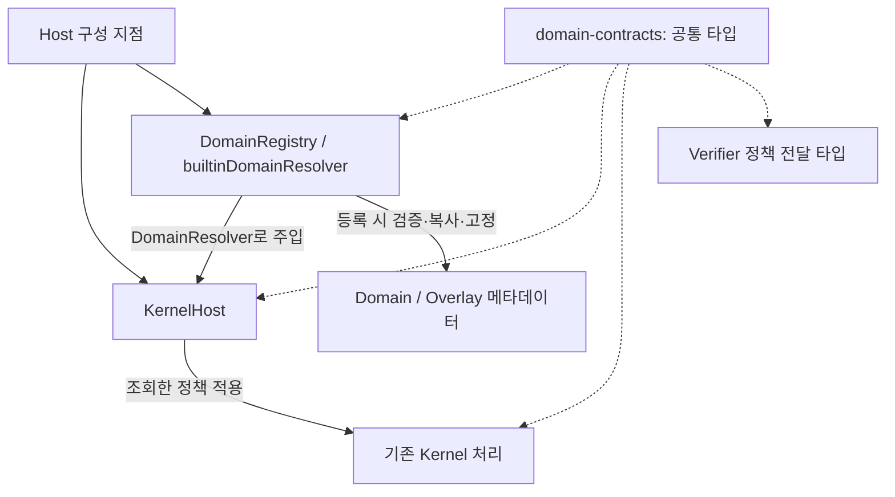

# ① 공통 계약·Resolver 구현 기록

이 문서는 2026-09-16 Kernel + Domain 재계획의 **첫 번째 구간**을 설명한다. 기존 `docs/stages/`의 단계 번호와는 별개다.

## 범위와 전체 순서

| 구간 | 책임 | 이번 작업의 경계 |
|---|---|---|
| ① 공통 계약·Resolver | 타입, 명시적 등록, 선택 검증, 정책 조회, Host 주입 | 구현 및 검증 대상 |
| ② GoalContract 처리 구간 | Prepare·Scan·Validate 내부 구현의 책임 재배치 | 이전 변경분 보관 |
| ③ Domain 실행 | General·Develop 준비·실행·Reasoning Policy 연결 | 이전 변경분 보관 |
| ④ Hackathon Overlay | 대회 정책을 기존 Domain 실행에 조합 | 메타데이터 호환 변환까지만 포함, 실행 구조 변경은 보관 |
| ⑤ Skill·Context | 자연어 지식의 발견·로딩·컨텍스트 전달 | Skill 참조 타입까지만 포함, 로더 변경은 보관 |
| ⑥ 복원·인터페이스 | 저장된 계획의 정책 결합, CLI·TUI·API 확장 | 선택 검증의 주입 호환성까지만 포함, 전체 연결은 보관 |

일괄 변경 37개 파일은 [분리 전 보관본](../../base_harness_work_archive/20260916T115623Z-before-stage1-split/README.md)에 보존했다. `before/`는 Git HEAD가 아니라 이번 일괄 구현 이전의 사용자 작업 상태다. 공유 파일의 과거 변경은 여러 구간이 섞여 있으므로 파일 전체를 덮어쓰지 말고 차이를 선별해야 한다.

## 구현 구조



`domain-contracts`에는 런타임 의존성이 없다. Kernel은 공통 타입을 사용하고 Registry 구현을 import하지 않는다. Registry는 실행 패키지를 import하지 않으며 조회 시 파일·네트워크·모델·도메인 콜백을 실행하지 않는다. 앱의 `coordinator-service.ts`에서 기본 Resolver를 Host에 명시적으로 주입한다.

### 공통 계약

- `DomainId`와 `OverlayId`는 특정 도메인 이름의 열거형이 아닌 문자열 식별자다. Registry는 실제 등록 여부와 식별자 형식을 검사한다.
- `DomainSelection`과 `DomainSelectionControl`은 현재 선택과 선택 변경 요청을 표현한다.
- `DomainManifest`와 `OverlayManifest`는 정책 메타데이터를 표현한다.
- `SkillRef`는 이름·개정·설명만 가진 지식 참조다. 권한 부여나 실행 콜백을 포함하지 않는다.
- `DomainPolicySnapshot`은 기존 Verifier 전달 형식을 유지한다. `DomainPolicy`는 Registry 내부에서 더 좁은 작업 종류와 측정 스키마 타입을 제공한다.
- `ResolvedDomain`은 읽기 전용 선택·정책·Skill 참조를 돌려준다.
- `DomainResolver`는 기본 선택, 조회, 선택 변경 정규화 포트다. 실행 어댑터나 Reasoning Policy를 정의하지 않는다.

기존 전달 형식의 `selection.skills`는 선택된 정책 보조 모듈 ID를 뜻한다. 새 `SkillRef`의 전문 자연어 지식과 다르다. 이번 단계에서는 기존 필드명을 바꾸지 않는다.

### 등록과 조회

1. Host 구성 전에 Domain과 Overlay를 명시적으로 등록한다.
2. 등록 시 필수 필드·값의 종류·중복·양방향 호환성 참조·기본 선택을 검증한다.
3. 등록 내용을 복사하고 중첩 값까지 동결한다. 원본 객체를 나중에 수정해도 등록 내용은 바뀌지 않는다.
4. 선택된 Domain의 작업 권한·검증·측정 정책을 가져오고, 호환되는 Overlay의 계획 관련 플래그와 개정을 조합한다.
5. 같은 이름의 Skill 참조는 동일하면 합치고, 개정이나 설명이 다르면 충돌로 거절한다.
6. 결과를 동결해 반환한다. 캐시는 최대 256개 선택을 보관하며, 제거되어도 호출자가 보유한 결과 값은 바뀌지 않는다.

선택에는 최대 64개 Overlay를 허용한다. 배열의 빈 슬롯, 중복 ID, 알 수 없는 이름, 호환되지 않는 조합은 명시적 오류가 된다. 등록되지 않은 이름을 기본 Domain으로 대체하지 않는다.

선택 변경은 기존 의미를 보존한다. `domain.set`은 보조 모듈 선택을 초기화한다. 보조 모듈 활성화 시 현재 Domain과 호환되지 않으면 해당 모듈의 기본 Domain을 사용하되, 앞서 선택한 모듈과 조합할 수 없으면 거절한다. Overlay는 Domain의 도구 권한을 확대하지 않는다.

Host가 기존 가변 객체 소비자에게 정책을 전달할 때는 별도 복사본을 만든다. 상태 화면의 정책 객체를 변경해도 Registry나 다음 권한 판단은 변하지 않는다.

### Host 연결 예

```ts
import { DomainRegistry } from "@base-harness/domain"
import type { DomainManifest } from "@base-harness/domain-contracts"
import { KernelHost } from "@base-harness/kernel-host"

const research: DomainManifest = {
  schemaVersion: "domain-spec-v1",
  id: "research",
  revision: "research-1",
  description: "등록된 자료를 검토하는 정책",
  allowedOperations: ["read", "search", "question", "control"],
  allowedSubagentTypes: [],
  planning: { requiresPlan: false },
  verification: { defaultStrength: "structural", criterionTemplates: ["observation"] },
  measurement: { summarySchemaVersion: "evidence-summary-v1", requiredFields: ["observed"] },
  compatibleOverlays: [],
  skills: [],
}

const domains = new DomainRegistry({
  defaultSelection: { domain: "research", skills: [] },
  domains: [research],
})

// existingCoordinator는 기존 실행·검증 포트를 구현한 객체다.
const host = new KernelHost(existingCoordinator, { domains })
```

이 예는 메타데이터와 정책의 연결을 보여준다. 새 검증 템플릿의 실제 의미와 실행 구현은 해당 소비자가 제공해야 한다. 임의의 템플릿 이름을 등록하는 것만으로 Verifier가 생기지는 않는다.

## 이전 코드와의 차이

| 항목 | 이전 | 이번 구간 이후 |
|---|---|---|
| Kernel의 Domain 타입 | `develop` / `general`에 고정 | 공통 문자열 ID 타입 사용 |
| 정책 획득 | Host에서 기본 전역 조회 함수 호출 | 주입한 Resolver를 통해 조회 |
| 새 Domain 연결 | 기존 열거형·정책 조회 변경 필요 | 명시적 Registry 등록 후 Host 주입 가능 |
| 결과 객체 | 가변 정책 객체 중심 | Registry 결과는 동결, 기존 소비자는 복사본 수신 |
| 보조 모듈 선택 검증 | 기본 목록 및 단일 선택 가정 | 등록된 호환 조합과 복수 선택 검증 |
| 잘못된 선택과 저장 계획 | 선택 검증 이전에 계획을 소비할 수 있음 | 먼저 검증해 거절된 선택이 저장 계획을 소모하지 않음 |
| 기존 카탈로그·Verifier 전달 형식 | General·Develop·Hackathon 리소스 | 기존 필드와 정책 결과 유지 |

## 의도적으로 남아 있는 후속 과제

- GoalContract 처리 코드를 각 내부 구간으로 옮기지는 않았다.
- Domain의 `prepare/run/reasoning` 콜백과 실행 어댑터는 이번 계약에 포함하지 않았다.
- 기존 Host의 Hackathon 전용 처리와 Kernel 생성 함수의 호환용 기본값은 남아 있다. 전체 Kernel/Domain 분리가 끝났다는 의미는 아니다.
- Skill 본문은 로딩하지 않는다. 기본 카탈로그의 `skills` 지식 참조는 현재 빈 배열이다.
- 저장된 **계획**에 Domain/Overlay 개정과 정책을 결합하는 작업은 후속 범위다. 이번 세션 저장 변경은 선택을 주입한 Resolver로 검증하기 위한 것이다.
- 현재 TUI·HTTP API는 기존 내장 선택 목록을 사용한다. 사용자 Domain의 동적 화면 선택은 ⑥에서 다룬다. TUI에는 내장 목록을 확인하는 작은 호환 검사를 두었다.
- 조회 경로는 동기식 메모리 연산이며 외부 호출이 없지만, 지연시간을 측정한 성능 벤치마크는 수행하지 않았다.
- 테스트의 사용자 Domain은 가짜 실행 포트로 정책 전달·권한 적용·세션 복원을 확인한다. 실제 LLM 문제 해결이나 별도 Domain Verifier 완성을 입증하지 않는다.

승인된 GoalContract, 기존 도구 권한 검사, Python Verifier의 Evidence/Ready 생성 권한은 기존 경계를 따른다.

## 검증 기록

이번 구간의 공통 계약·등록/조회·기존 소비자 연결은 완료했다. 전체 하네스의 기존 결함 수정은 이 완료 범위에 포함하지 않는다.

| 검사 | 결과 |
|---|---|
| 변경 전 Kernel·Host 기준 검사 | 96 통과, 0 실패 |
| Domain·Kernel·Host 검사 | 136 통과, 0 실패, 659 assertions |
| CLI·TUI 관련 기존 검사 4개 파일 | 52 통과, 0 실패 |
| domain-contracts / domain / kernel / kernel-host / verification / coordinator / tui 타입 검사 | 7개 패키지 통과 |
| App 타입 검사 | 기존 CLI 오류 3개 유지, 기준 로그와 진단 내용 일치 |
| 모듈 의존성 경계 검사 | 통과 |
| frozen lockfile 확인 | 통과, 외부 패키지 버전 변경 없이 workspace 연결 변경 |
| 전체 `test:harness` | 258 통과, 5 실패 / 263개 |
| 실패한 2개 파일의 변경 전 소스 대조 실행 | 11 통과, 동일한 5개 실패 / 16개 |
| 후속 구간 전용 파일의 보존 확인 | 18개 파일의 원본 해시 또는 원래 부재 상태 일치 |

전체 회귀검사의 기존 실패는 다음 두 곳이다.

- `coordinator/test/plan-execution-run.test.ts`: `accepted`, `revised` 시나리오에서 root 통합 수행을 기대하지만 수행되지 않는다.
- `coordinator/test/real-parallel-repair.test.ts`: `root-provider-failure`, `root-harness-failure`, `missing-integration` 시나리오에서 `blocked`를 기대하지만 `ready`가 반환된다.

변경 전 대조 실행은 별도 임시 디렉터리에 실행 관련 패키지를 복사하고, 이번 변경 파일을 보관된 `before/`·`stage1-start/` 소스로 복원한 뒤 수행했다. workspace 패키지 링크도 복사본을 가리키도록 분리했다. 외부 라이브러리와 이번 작업에서 바꾸지 않은 Python Verifier는 동일하게 사용했다. 실패 이름뿐 아니라 기대값·실제값도 일치했다.

따라서 ①의 완료를 전체 하네스가 정상 실행되거나 올바르게 완료를 판정한다는 보증으로 확대해서는 안 된다. 특히 root 통합 실패가 `ready`로 표시되는 기존 실패는 실행 연결 구간에서 별도로 해결해야 한다.

App의 기존 오류는 `src/cli/cmd/run.ts`의 `planId` 접근 2곳과 `executionBackend` 옵션 1곳이다. 이 파일은 이번 구간에서 변경하지 않았다.

실행 명령은 `runtime/` 기준이다.

```sh
bun test ./packages/domain/test ./packages/kernel/test ./packages/kernel-host/test
bun test ./packages/base-harness/test/cli/run-harness-output.test.ts ./packages/tui/test/harness-session-controls.test.ts ./packages/tui/test/harness-control-response.test.ts ./packages/tui/test/harness-status-presentation.test.ts
bun run --cwd packages/domain-contracts typecheck
bun run --cwd packages/domain typecheck
bun run --cwd packages/kernel typecheck
bun run --cwd packages/kernel-host typecheck
bun run --cwd packages/verification typecheck
bun run --cwd packages/coordinator typecheck
bun run --cwd packages/tui typecheck
bun run --cwd packages/base-harness typecheck
bun run check:harness-boundaries
bun install --ignore-scripts --lockfile-only --frozen-lockfile
BASE_HARNESS_PYTHON=python3 bun run test:harness
```

원본 로그, 이번 구간 파일별 SHA-256, `stage1-only.patch`는 [동일 보관 디렉터리](../../base_harness_work_archive/20260916T115623Z-before-stage1-split/README.md)의 `stage1-checks/`, `stage1-inventory.json`, `stage1-only.patch`에 둔다. 패치는 사용자 기존 변경이 포함된 시작 상태를 기준으로 하므로 Git HEAD에 그대로 적용하는 용도가 아니다.

## 코드 위치

- [공통 계약](../runtime/packages/domain-contracts/src/index.ts)
- [Registry](../runtime/packages/domain/src/registry.ts), [입력 검증](../runtime/packages/domain/src/validation.ts)
- [내장 카탈로그 호환 계층](../runtime/packages/domain/src/index.ts)
- [Host 주입과 정책 소비](../runtime/packages/kernel-host/src/index.ts)
- [세션 선택 검증](../runtime/packages/kernel-host/src/session-state-store.ts)
- [앱 구성 지점](../runtime/packages/base-harness/src/harness/coordinator-service.ts)
- [Registry 테스트](../runtime/packages/domain/test/registry.test.ts), [Host 연결 테스트](../runtime/packages/kernel-host/test/resolver-contract.test.ts)
- [컴파일 시 타입 계약 검사](../runtime/packages/domain-contracts/test/contracts.types.ts)
- [모듈 의존성 검사](../runtime/script/check-harness-boundaries.ts)
